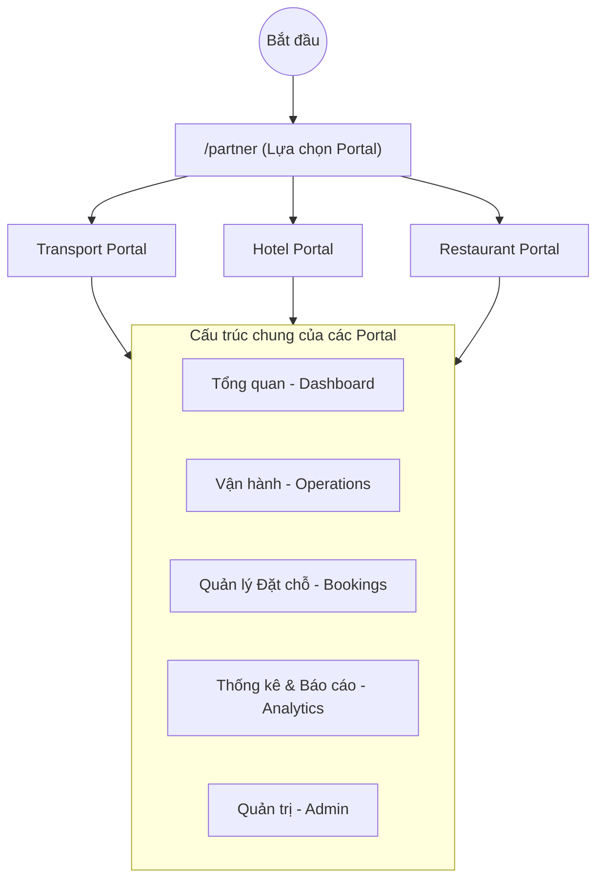
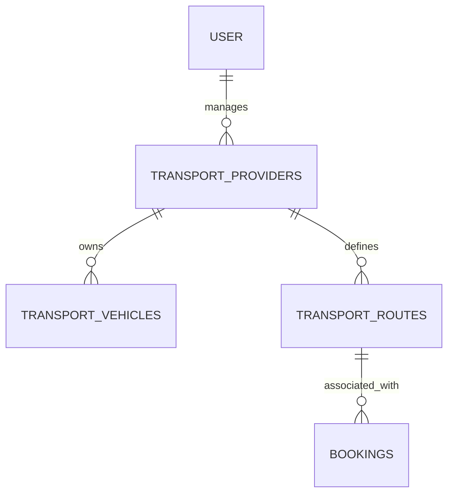

# Tài liệu Luồng Đối tác (Partner Flow) - TripC

Tài liệu này mô tả luồng trải nghiệm của Đối tác (Partner) từ khi vào cổng thông tin đến việc quản lý các dịch vụ cụ thể trên hệ thống TripC.

## 1. Tổng quan Luồng Truy cập

Đối tác truy cập vào hệ thống TripC thông qua cổng `/partner`. Tại đây, họ sẽ chọn loại hình dịch vụ mà mình cung cấp.

---

## 2. Chi tiết các Portal

### 2.1. Transport Portal (Cổng Vận tải)
Đây là cổng dành cho các nhà xe, công ty vận chuyển.

- **Dashboard**: Xem nhanh doanh thu, số lượng chuyến xe trong ngày và các đặt chỗ mới nhất.
- **Vận hành (Operations)**:
    - `Quản lý đội xe (Fleet Management)`: Thêm/Sửa/Xóa xe, quản lý tiện ích trên xe.
    - `Quản lý tuyến đường (Route Management)`: Thiết lập điểm đi, điểm đến và các điểm dừng.
    - `Quản lý tài xế (Driver Management)`: Phân công tài xế vào các chuyến xe.
    - `Lịch trình xe (Vehicle Schedule)`: Sắp xếp chuyến xe theo thời gian thực.
- **Đặt chỗ (Bookings)**:
    - `Quản lý đặt chỗ`: Xem danh sách khách hàng đã đặt vé.
    - `Quản lý giá (Pricing)`: Thiết lập giá vé linh hoạt theo mùa hoặc theo loại xe.
    - `Sơ đồ ghế (Seat Management)`: Tùy chỉnh vị trí ghế ngồi cho từng loại xe.
- **Thống kê (Analytics)**:
    - `Hiệu suất`: Đánh giá tỷ lệ lấp đầy ghế và hiệu quả hoạt động.
    - `Doanh thu`: Báo cáo chi tiết dòng tiền.

### 2.2. Hotel Portal (Cổng Khách sạn)
Dành cho chủ khách sạn, homestay hoặc resort.

- **Dashboard**: Trạng thái phòng (trống, đang ở, sắp tới), tỷ lệ lấp đầy.
- **Vận hành**: Quản lý các loại phòng (Standard, Deluxe, Suite), tiện nghi.
- **Đặt phòng**: Xử lý check-in/check-out, quản lý yêu cầu đặc biệt của khách.
- **Phân phối**: Kết nối với các kênh bán phòng khác (nếu có).

### 2.3. Restaurant Portal (Cổng Nhà hàng)
Dành cho các chủ quán ăn, nhà hàng.

- **Dashboard**: Tổng hợp đơn hàng trong ngày, doanh thu thực tế.
- **Vận hành**: 
    - `Thực đơn (Menu)`: Quản lý món ăn, combo, khuyến mãi.
    - `Bàn (Table)`: Quản lý sơ đồ bàn và trạng thái bàn.
- **Đơn hàng**: Quản lý đơn tại chỗ và đơn mang đi.

---

## 3. Cơ sở Dữ liệu & Luồng Dữ liệu (Transport)

Dưới đây là chi tiết kỹ thuật về cách hệ thống Transport trao đổi dữ liệu:

### 3.1. Sơ đồ Thực thể (ER Diagram)
Hệ thống sử dụng quan hệ phân cấp từ User -> Provider -> Assets/Routes.

### 3.2. Luồng gọi từ Transport User đến DB
Mọi truy vấn đều phải đi qua lớp xác thực và lọc theo `provider_id` để đảm bảo tính riêng tư dữ liệu giữa các đối tác.

1.  **Xác thực**: Lấy `user.id` từ `Auth`.
2.  **Liên kết**: Tìm tất cả `transport_providers` mà User đó là chủ sở hữu.
3.  **Truy vấn**: Sử dụng danh sách `provider_id` để `SELECT` dữ liệu từ các bảng `vehicles`, `routes`, `bookings`.

---

## 4. Luồng Quản trị Chung (Admin Flow)

Mỗi Portal đều tích hợp các công cụ quản trị giúp đối tác duy trì hoạt động kinh doanh:

1.  **Thông báo (Notifications)**: Nhận cập nhật về các đơn đặt chỗ mới, phản hồi từ khách hàng hoặc yêu cầu từ hệ thống.
2.  **Đánh giá (Reviews)**: Theo dõi phản hồi của người dùng để cải thiện chất lượng dịch vụ.
3.  **Cài đặt (Settings)**: 
    - Cập nhật thông tin profile của nhà cung cấp.
    - Thiết lập phương thức thanh toán.
    - Cấu hình giờ làm việc.

---

## 4. Công nghệ Sử dụng

- **Frontend**: Next.js (App Router), Tailwind CSS.
- **State Management**: React Hooks (`useState`, `useEffect`).
- **Icons**: Lucide React.
- **Animations**: Framer Motion (tạo hiệu ứng mượt mà khi chuyển tab/section).
- **Backend/Data**: Supabase (Real-time updates cho đơn đặt chỗ và thông báo).
