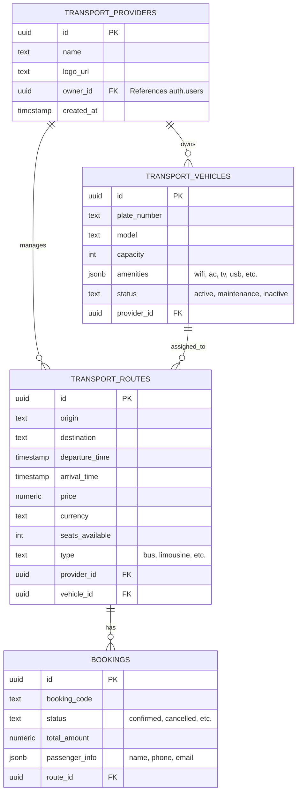
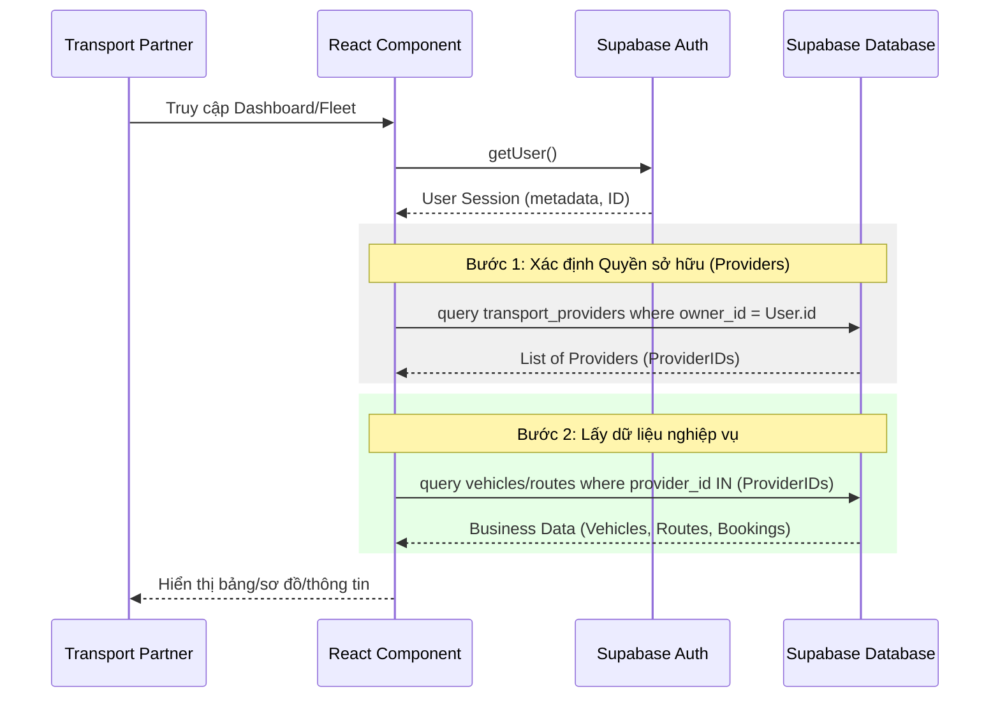

# Transport Partner Flow & Database Schema

Tài liệu này chi tiết về luồng dữ liệu và cấu trúc cơ sở dữ liệu dành riêng cho dịch vụ Vận tải (Transport) trên hệ thống TripC.

## 1. Cơ sở Dữ liệu (Database Schema)

Dưới đây là các bảng chính trong hệ thống Supabase liên quan đến Transport Partner.



---

## 2. Luồng Gọi Dữ liệu (Data Flow)

Luồng logic từ khi User (Đối tác) đăng nhập đến khi hiển thị dữ liệu trên các module (Fleet, Routes, Bookings).



---

## 3. Các API/Query Chính

### 3.1. Lấy danh sách xe (Fleet Management)
```typescript
const { data } = await supabase
    .from('transport_vehicles')
    .select('*')
    .in('provider_id', providerIds)
```

### 3.2. Lấy danh sách đặt chỗ (Booking Management)
```typescript
const { data } = await supabase
    .from('bookings')
    .select(`
        *,
        transport_routes (*)
    `)
    .order('created_at', { ascending: false })
```

---

## 4. Ghi chú Bảo mật (RLS)
- **Row Level Security (RLS)** được kích hoạt trên tất cả các bảng.
- Đối tác chỉ có thể xem/sửa dữ liệu mà họ sở hữu (`owner_id` hoặc thông qua `provider_id` liên kết).
