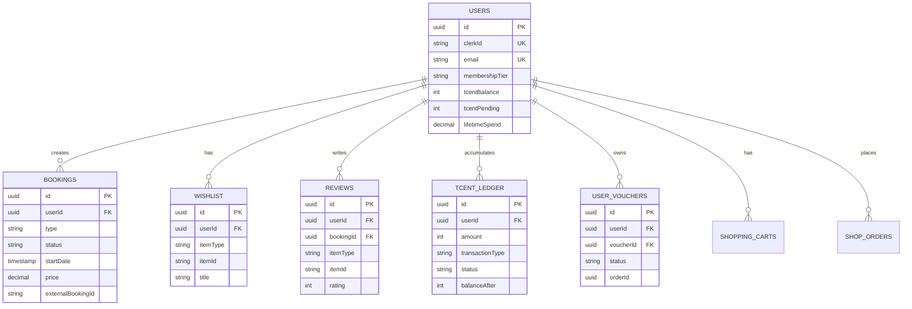
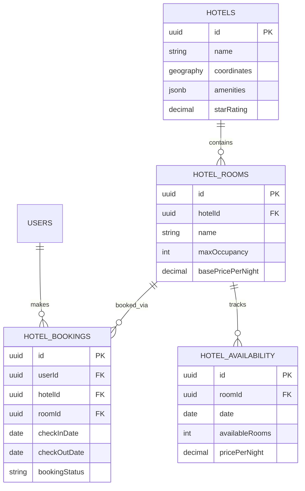
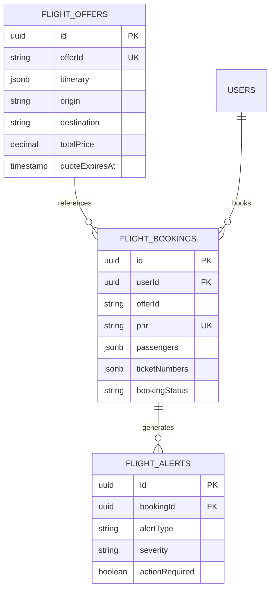
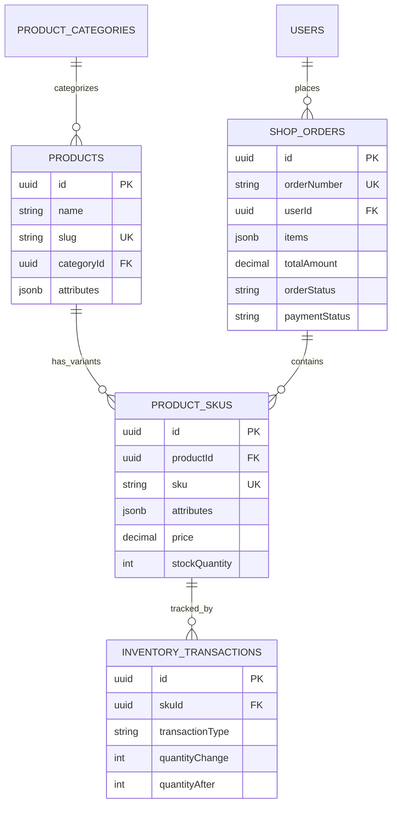
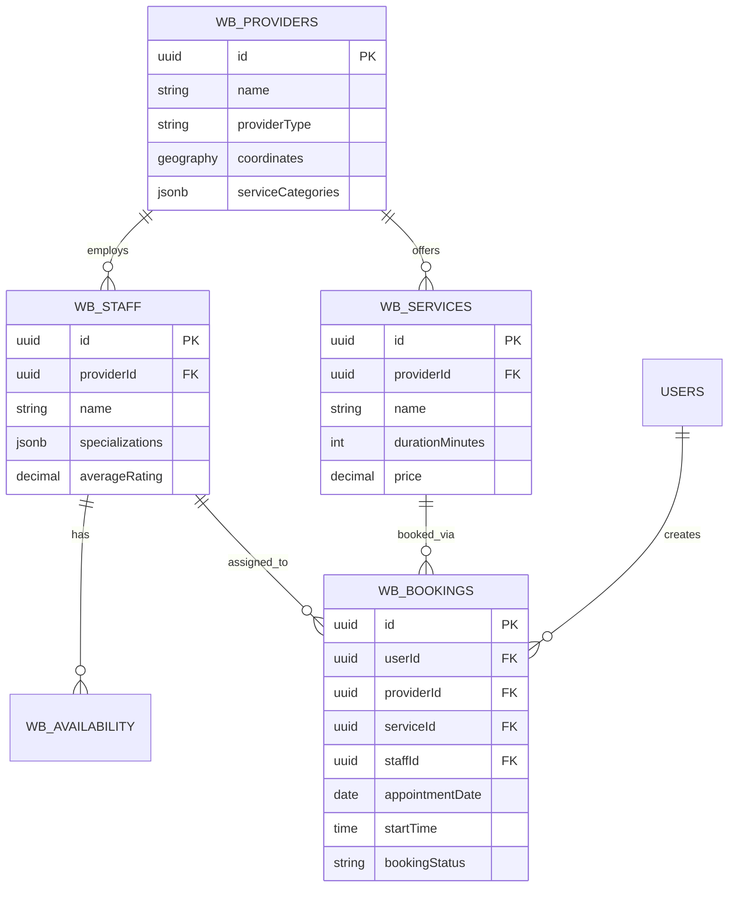
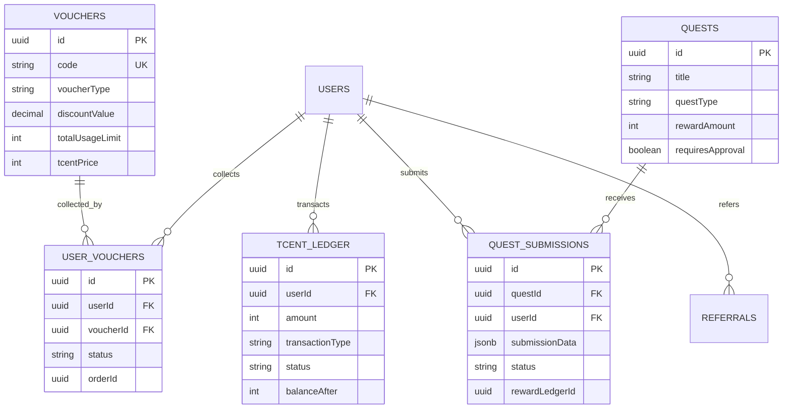

# TripC SuperApp - Database Schema & ERD

> **Version**: 2.0 (Supabase)  
> **Last Updated**: January 23, 2026  
> **Database Type**: Supabase (PostgreSQL with Realtime)

---

## Table of Contents

1. [System Architecture Overview](#system-architecture-overview)
2. [Core Entities (Shared)](#core-entities-shared)
3. [Hotel Service Schema](#hotel-service-schema)
4. [Flight Service Schema](#flight-service-schema)
5. [Dining Service Schema](#dining-service-schema)
6. [Transport Service Schema](#transport-service-schema)
7. [Shop Service Schema](#shop-service-schema)
8. [Wellness & Beauty Service Schema](#wellness--beauty-service-schema)
9. [Voucher & Rewards System Schema](#voucher--rewards-system-schema)
10. [Entity Relationship Diagrams](#entity-relationship-diagrams)
11. [Indexes & Performance](#indexes--performance)
12. [Data Integrity Rules](#data-integrity-rules)

---

## System Architecture Overview

### Database Strategy

```
┌─────────────────────────────────────────────────────────────┐
│                    TripC Data Layer                         │
├─────────────────────────────────────────────────────────────┤
│                                                             │
│  ┌──────────────────────────────────────────────────────┐   │
│  │         Supabase PostgreSQL Database                 │   │
│  │                                                      │   │
│  │  ┌────────────┐  ┌────────────┐  ┌──────────┐        │   │
│  │  │   Users    │  │  Bookings  │  │ Wishlist │        │   │
│  │  │  Profiles  │  │  (All)     │  │ Reviews  │        │   │
│  │  └────────────┘  └────────────┘  └──────────┘        │   │
│  │                                                      │   │
│  │  ┌────────────┐  ┌────────────┐  ┌──────────┐        │   │
│  │  │   Hotels   │  │  Flights   │  │  Dining  │        │   │
│  │  │   Rooms    │  │   Orders   │  │Restaurants│       │   │
│  │  └────────────┘  └────────────┘  └──────────┘        │   │
│  │                                                      │   │
│  │  ┌────────────┐  ┌────────────┐  ┌──────────┐        │   │
│  │  │ Transport  │  │    Shop    │  │ Wellness │        │   │
│  │  │  Bookings  │  │  Products  │  │  Beauty  │        │   │
│  │  └────────────┘  └────────────┘  └──────────┘        │   │
│  │                                                      │   │
│  │  ┌────────────┐  ┌────────────┐                      │   │
│  │  │  Vouchers  │  │   Tcent    │                      │   │
│  │  │   Quests   │  │   Ledger   │                      │   │
│  │  └────────────┘  └────────────┘                      │   │
│  │                                                      │   │
│  └──────────────────────────────────────────────────────┘   │
│                                                             │
│  ┌──────────────────┐         ┌────────────────────┐        │
│  │ Supabase Realtime│         │  Supabase Storage  │        │
│  │ (Subscriptions)  │         │  (Media/Files)     │        │
│  │                  │         │                    │        │
│  │ • Live Updates   │         │ • Product Images   │        │
│  │ • Notifications  │         │ • User Avatars     │        │
│  │ • Chat Messages  │         │ • Documents        │        │
│  └──────────────────┘         └────────────────────┘        │
│                                                             │
│  ┌──────────────────┐         ┌────────────────────┐        │
│  │ Supabase Edge    │         │ Supabase Vector    │        │
│  │ Functions        │         │ (pgvector)         │        │
│  │                  │         │                    │        │
│  │ • Payment        │         │ • Semantic Search  │        │
│  │ • Notifications  │         │ • Recommendations  │        │
│  │ • External APIs  │         │ • AI Features      │        │
│  └──────────────────┘         └────────────────────┘        │
│                                                             │
└─────────────────────────────────────────────────────────────┘
```

### Data Flow Principles

- **Supabase PostgreSQL**: All data storage with ACID transactions
- **Supabase Realtime**: Live updates for bookings, notifications, chat
- **Supabase Auth**: Built-in authentication (integrates with Clerk via JWT)
- **Supabase Storage**: File uploads (images, documents, avatars)
- **Supabase Edge Functions**: Serverless functions for payments, webhooks, external APIs
- **Row Level Security (RLS)**: Fine-grained access control at database level
- **pgvector**: Semantic search and AI-powered recommendations

---

## Core Entities (Shared)

### 1. Users Table (Convex)

```typescript
// Convex Schema
users: defineTable({
  clerkId: v.string(), // Clerk authentication ID
  email: v.string(),
  name: v.optional(v.string()),
  firstName: v.optional(v.string()),
  lastName: v.optional(v.string()),
  phoneNumber: v.optional(v.string()),
  imageUrl: v.optional(v.string()),

  // Membership & Loyalty
  membershipTier: v.union(
    v.literal("BRONZE"),
    v.literal("SILVER"),
    v.literal("GOLD"),
    v.literal("PLATINUM"),
  ),
  tcentBalance: v.number(), // Loyalty points (100 Tcents = $1 USD)
  tcentPending: v.number(), // Pending approval points
  lifetimeSpend: v.number(), // Total USD spent (for tier calculation)

  // Preferences
  currency: v.string(), // Preferred currency (VND, USD)
  language: v.string(), // Preferred language (vi, en)
  timezone: v.string(), // User timezone
  location: v.optional(
    v.object({
      city: v.string(),
      country: v.string(),
      coordinates: v.object({ lat: v.number(), lng: v.number() }),
    }),
  ),

  // Metadata
  createdAt: v.number(),
  updatedAt: v.number(),
  lastLoginAt: v.optional(v.number()),
  isActive: v.boolean(),
  isVerified: v.boolean(),
})
  .index("by_clerk_id", ["clerkId"])
  .index("by_email", ["email"])
  .index("by_tier", ["membershipTier"]);
```

### 2. Bookings Table (Convex - Base)

```typescript
// Convex Schema - Base bookings table for all service types
bookings: defineTable({
  userId: v.id("users"),

  // Service Type Discriminator
  type: v.union(
    v.literal("hotel"),
    v.literal("flight"),
    v.literal("restaurant"),
    v.literal("activity"),
    v.literal("event"),
    v.literal("wellness"),
    v.literal("beauty"),
    v.literal("transport"),
  ),

  // Common Fields
  title: v.string(),
  description: v.optional(v.string()),
  imageUrl: v.optional(v.string()),

  // Dates
  startDate: v.number(), // Unix timestamp
  endDate: v.optional(v.number()),

  // Status
  status: v.union(
    v.literal("pending"),
    v.literal("confirmed"),
    v.literal("cancelled"),
    v.literal("completed"),
    v.literal("refunded"),
    v.literal("no_show"),
  ),

  // Financial
  price: v.number(), // Total price
  currency: v.string(),
  breakdown: v.optional(
    v.object({
      base: v.number(),
      taxes: v.number(),
      fees: v.number(),
      discount: v.number(),
      tcentUsed: v.number(),
    }),
  ),

  // Reference to detailed booking in PostgreSQL
  externalBookingId: v.optional(v.string()),

  // Metadata
  metadata: v.optional(v.any()), // Service-specific data
  createdAt: v.number(),
  updatedAt: v.number(),
})
  .index("by_user", ["userId"])
  .index("by_status", ["status"])
  .index("by_type", ["type"])
  .index("by_user_and_status", ["userId", "status"])
  .index("by_user_and_type", ["userId", "type"]);
```

### 3. Wishlist Table (Convex)

```typescript
wishlist: defineTable({
  userId: v.id("users"),

  itemType: v.string(), // hotel, restaurant, activity, product, etc.
  itemId: v.string(), // External ID in respective service

  // Display Data (cached for quick retrieval)
  title: v.string(),
  imageUrl: v.optional(v.string()),
  price: v.optional(v.number()),
  location: v.optional(v.string()),
  rating: v.optional(v.number()),

  // Metadata
  tags: v.optional(v.array(v.string())),
  notes: v.optional(v.string()),
  createdAt: v.number(),
})
  .index("by_user", ["userId"])
  .index("by_user_and_item", ["userId", "itemId"])
  .index("by_item_type", ["itemType"]);
```

### 4. Reviews Table (Convex)

```typescript
reviews: defineTable({
  userId: v.id("users"),
  bookingId: v.optional(v.id("bookings")),

  // Target
  itemType: v.string(),
  itemId: v.string(),

  // Review Content
  rating: v.number(), // 1-5 stars
  title: v.optional(v.string()),
  comment: v.optional(v.string()),

  // Structured Ratings
  aspectRatings: v.optional(
    v.object({
      cleanliness: v.optional(v.number()),
      service: v.optional(v.number()),
      value: v.optional(v.number()),
      location: v.optional(v.number()),
      amenities: v.optional(v.number()),
    }),
  ),

  // Media
  photos: v.optional(v.array(v.string())),

  // Verification
  isVerified: v.boolean(), // Verified purchase

  // Moderation
  status: v.union(
    v.literal("pending"),
    v.literal("approved"),
    v.literal("rejected"),
  ),

  // Engagement
  helpfulCount: v.number(),

  createdAt: v.number(),
  updatedAt: v.number(),
})
  .index("by_item", ["itemType", "itemId"])
  .index("by_user", ["userId"])
  .index("by_booking", ["bookingId"])
  .index("by_status", ["status"]);
```

---

## Hotel Service Schema

### PostgreSQL Tables

```sql
-- Hotels Master Data
CREATE TABLE hotels (
  id UUID PRIMARY KEY DEFAULT gen_random_uuid(),

  -- Basic Info
  name VARCHAR(255) NOT NULL,
  slug VARCHAR(255) UNIQUE NOT NULL,
  brand VARCHAR(255),
  chain_id UUID,

  -- Location
  address TEXT NOT NULL,
  city VARCHAR(100) NOT NULL,
  state VARCHAR(100),
  country VARCHAR(100) NOT NULL,
  postal_code VARCHAR(20),
  coordinates GEOGRAPHY(POINT),

  -- Contact
  phone VARCHAR(50),
  email VARCHAR(255),
  website VARCHAR(500),

  -- Classification
  star_rating DECIMAL(2,1),
  property_type VARCHAR(50), -- hotel, resort, hostel, apartment

  -- Media
  images JSONB,              -- [{url, caption, order}]
  virtual_tour_url VARCHAR(500),

  -- Amenities
  amenities JSONB,           -- ["wifi", "pool", "gym", "spa"]

  -- Policies
  check_in_time TIME,
  check_out_time TIME,
  cancellation_policy TEXT,
  pet_policy TEXT,
  child_policy TEXT,

  -- Status
  is_active BOOLEAN DEFAULT true,
  is_partner BOOLEAN DEFAULT false,
  partner_id UUID,

  -- SEO & Discovery
  description TEXT,
  highlights JSONB,
  nearby_attractions JSONB,

  -- Metadata
  created_at TIMESTAMP WITH TIME ZONE DEFAULT NOW(),
  updated_at TIMESTAMP WITH TIME ZONE DEFAULT NOW(),

  CONSTRAINT valid_rating CHECK (star_rating >= 0 AND star_rating <= 5)
);

CREATE INDEX idx_hotels_location ON hotels USING GIST(coordinates);
CREATE INDEX idx_hotels_city ON hotels(city, country);
CREATE INDEX idx_hotels_active ON hotels(is_active) WHERE is_active = true;


-- Room Types
CREATE TABLE hotel_rooms (
  id UUID PRIMARY KEY DEFAULT gen_random_uuid(),
  hotel_id UUID NOT NULL REFERENCES hotels(id) ON DELETE CASCADE,

  -- Room Info
  name VARCHAR(255) NOT NULL,
  slug VARCHAR(255) NOT NULL,
  room_type VARCHAR(50), -- standard, deluxe, suite

  -- Capacity
  max_occupancy INT NOT NULL,
  max_adults INT NOT NULL,
  max_children INT,
  bed_configuration JSONB, -- [{type: "king", count: 1}]

  -- Size
  size_sqm DECIMAL(10,2),

  -- Amenities
  amenities JSONB,

  -- Media
  images JSONB,

  -- Inventory
  total_rooms INT NOT NULL,

  -- Pricing (base)
  base_price_per_night DECIMAL(10,2) NOT NULL,
  currency VARCHAR(3) DEFAULT 'USD',

  -- Status
  is_active BOOLEAN DEFAULT true,

  created_at TIMESTAMP WITH TIME ZONE DEFAULT NOW(),
  updated_at TIMESTAMP WITH TIME ZONE DEFAULT NOW(),

  UNIQUE(hotel_id, slug)
);

CREATE INDEX idx_hotel_rooms_hotel ON hotel_rooms(hotel_id);


-- Hotel Bookings (Detailed)
CREATE TABLE hotel_bookings (
  id UUID PRIMARY KEY DEFAULT gen_random_uuid(),
  convex_booking_id VARCHAR(255) UNIQUE, -- Link to Convex bookings table

  -- User
  user_id UUID NOT NULL,
  clerk_id VARCHAR(255) NOT NULL,

  -- Hotel & Room
  hotel_id UUID NOT NULL REFERENCES hotels(id),
  room_id UUID NOT NULL REFERENCES hotel_rooms(id),

  -- Dates
  check_in_date DATE NOT NULL,
  check_out_date DATE NOT NULL,
  nights INT GENERATED ALWAYS AS (check_out_date - check_in_date) STORED,

  -- Guests
  adults INT NOT NULL,
  children INT DEFAULT 0,
  guest_names JSONB, -- [{firstName, lastName, age}]

  -- Pricing
  room_rate_per_night DECIMAL(10,2) NOT NULL,
  total_nights_cost DECIMAL(10,2) NOT NULL,
  taxes DECIMAL(10,2) DEFAULT 0,
  service_fee DECIMAL(10,2) DEFAULT 0,
  cleaning_fee DECIMAL(10,2) DEFAULT 0,
  discount DECIMAL(10,2) DEFAULT 0,
  total_amount DECIMAL(10,2) NOT NULL,
  currency VARCHAR(3) DEFAULT 'USD',

  -- Payment
  payment_status VARCHAR(50) NOT NULL, -- pending, paid, partially_paid, refunded
  payment_method VARCHAR(50),
  payment_details JSONB,

  -- Status
  booking_status VARCHAR(50) NOT NULL, -- pending, confirmed, checked_in, checked_out, cancelled, no_show

  -- Special Requests
  special_requests TEXT,
  early_check_in BOOLEAN DEFAULT false,
  late_check_out BOOLEAN DEFAULT false,

  -- Cancellation
  cancellation_policy JSONB, -- Snapshot at booking time
  cancelled_at TIMESTAMP WITH TIME ZONE,
  cancellation_reason TEXT,
  refund_amount DECIMAL(10,2),

  -- Confirmation
  confirmation_code VARCHAR(50) UNIQUE NOT NULL,

  -- Timestamps
  created_at TIMESTAMP WITH TIME ZONE DEFAULT NOW(),
  updated_at TIMESTAMP WITH TIME ZONE DEFAULT NOW(),

  CONSTRAINT valid_dates CHECK (check_out_date > check_in_date),
  CONSTRAINT valid_guests CHECK (adults > 0),
  CONSTRAINT valid_total CHECK (total_amount >= 0)
);

CREATE INDEX idx_hotel_bookings_user ON hotel_bookings(user_id);
CREATE INDEX idx_hotel_bookings_hotel ON hotel_bookings(hotel_id);
CREATE INDEX idx_hotel_bookings_dates ON hotel_bookings(check_in_date, check_out_date);
CREATE INDEX idx_hotel_bookings_status ON hotel_bookings(booking_status);


-- Hotel Availability (For inventory management)
CREATE TABLE hotel_availability (
  id UUID PRIMARY KEY DEFAULT gen_random_uuid(),
  room_id UUID NOT NULL REFERENCES hotel_rooms(id) ON DELETE CASCADE,

  date DATE NOT NULL,
  available_rooms INT NOT NULL,
  price_per_night DECIMAL(10,2) NOT NULL,

  -- Dynamic Pricing
  is_weekend BOOLEAN DEFAULT false,
  is_holiday BOOLEAN DEFAULT false,
  occupancy_rate DECIMAL(5,2), -- For dynamic pricing

  -- Restrictions
  min_stay_nights INT DEFAULT 1,
  max_stay_nights INT,
  closed_to_arrival BOOLEAN DEFAULT false,
  closed_to_departure BOOLEAN DEFAULT false,

  updated_at TIMESTAMP WITH TIME ZONE DEFAULT NOW(),

  UNIQUE(room_id, date),
  CONSTRAINT valid_availability CHECK (available_rooms >= 0)
);

CREATE INDEX idx_hotel_avail_room_date ON hotel_availability(room_id, date);
CREATE INDEX idx_hotel_avail_date_range ON hotel_availability(date);
```

---

## Flight Service Schema

### PostgreSQL Tables

```sql
-- Flights (Offers from aggregation)
CREATE TABLE flight_offers (
  id UUID PRIMARY KEY DEFAULT gen_random_uuid(),
  offer_id VARCHAR(255) UNIQUE NOT NULL, -- Supplier offer ID

  -- Itinerary
  itinerary JSONB NOT NULL, -- [{segments: [...], duration, stops}]

  -- Origin & Destination
  origin VARCHAR(10) NOT NULL,
  destination VARCHAR(10) NOT NULL,

  -- Dates
  departure_date DATE NOT NULL,
  return_date DATE,
  is_round_trip BOOLEAN DEFAULT false,

  -- Fare
  fare_family VARCHAR(100),
  fare_class VARCHAR(10),
  cabin_class VARCHAR(20), -- economy, premium_economy, business, first

  -- Pricing
  base_price DECIMAL(10,2) NOT NULL,
  taxes DECIMAL(10,2) NOT NULL,
  fees DECIMAL(10,2) DEFAULT 0,
  total_price DECIMAL(10,2) NOT NULL,
  currency VARCHAR(3) DEFAULT 'USD',

  -- Passengers
  adult_count INT NOT NULL DEFAULT 1,
  child_count INT DEFAULT 0,
  infant_count INT DEFAULT 0,

  -- Attributes
  baggage_allowance JSONB, -- [{type: "checked", weight: 23, unit: "kg"}]
  refundable BOOLEAN DEFAULT false,
  changeable BOOLEAN DEFAULT true,
  change_fee DECIMAL(10,2),

  -- Supplier
  supplier_name VARCHAR(100),
  supplier_refs JSONB,

  -- Fare Rules
  fare_rules_snapshot TEXT,

  -- Validity
  quote_expires_at TIMESTAMP WITH TIME ZONE NOT NULL,

  created_at TIMESTAMP WITH TIME ZONE DEFAULT NOW(),

  CONSTRAINT valid_passengers CHECK (adult_count > 0 AND infant_count <= adult_count)
);

CREATE INDEX idx_flight_offers_route ON flight_offers(origin, destination, departure_date);
CREATE INDEX idx_flight_offers_expiry ON flight_offers(quote_expires_at);


-- Flight Bookings
CREATE TABLE flight_bookings (
  id UUID PRIMARY KEY DEFAULT gen_random_uuid(),
  convex_booking_id VARCHAR(255) UNIQUE,

  -- User
  user_id UUID NOT NULL,
  clerk_id VARCHAR(255) NOT NULL,

  -- Offer
  offer_id VARCHAR(255) NOT NULL, -- Reference to flight_offers

  -- PNR & Tickets
  pnr VARCHAR(100) UNIQUE, -- Passenger Name Record
  supplier_refs JSONB, -- {amadeus: "ABC123", sabre: "XYZ789"}
  ticket_numbers JSONB, -- [{passenger_id, ticket_number, issued_at}]

  -- Passengers
  passengers JSONB NOT NULL, -- Full passenger details with docs
  -- [{
  --   pax_type: "ADT",
  --   title: "Mr",
  --   first_name: "John",
  --   last_name: "Doe",
  --   dob: "1990-01-01",
  --   gender: "M",
  --   passport_number: "AB123456",
  --   passport_nationality: "US",
  --   passport_expiry: "2030-01-01",
  --   frequent_flyer: {...}
  -- }]

  -- Pricing (Snapshot at booking)
  fare_rules_snapshot JSONB,
  price_breakdown JSONB,
  total_amount DECIMAL(10,2) NOT NULL,
  currency VARCHAR(3) DEFAULT 'USD',

  -- Ancillaries
  ancillaries JSONB, -- [{type: "baggage", code: "1PC", price: 50, passenger_id}]

  -- Status
  booking_status VARCHAR(50) NOT NULL, -- pending, confirmed, ticketed, cancelled, completed
  payment_status VARCHAR(50) NOT NULL,

  -- Contact
  contact_email VARCHAR(255) NOT NULL,
  contact_phone VARCHAR(50) NOT NULL,

  -- Changes & Cancellations
  change_history JSONB, -- [{changed_at, changed_by, old_value, new_value}]
  cancelled_at TIMESTAMP WITH TIME ZONE,
  refund_amount DECIMAL(10,2),

  -- Confirmation
  confirmation_code VARCHAR(50) UNIQUE NOT NULL,

  -- Timestamps
  created_at TIMESTAMP WITH TIME ZONE DEFAULT NOW(),
  updated_at TIMESTAMP WITH TIME ZONE DEFAULT NOW()
);

CREATE INDEX idx_flight_bookings_user ON flight_bookings(user_id);
CREATE INDEX idx_flight_bookings_pnr ON flight_bookings(pnr);
CREATE INDEX idx_flight_bookings_status ON flight_bookings(booking_status);


-- Flight Alerts (Schedule changes, cancellations)
CREATE TABLE flight_alerts (
  id UUID PRIMARY KEY DEFAULT gen_random_uuid(),
  booking_id UUID NOT NULL REFERENCES flight_bookings(id),

  alert_type VARCHAR(50) NOT NULL, -- schedule_change, cancellation, gate_change
  severity VARCHAR(20) NOT NULL, -- info, warning, critical

  message TEXT NOT NULL,
  details JSONB,

  -- Actions
  action_required BOOLEAN DEFAULT false,
  action_deadline TIMESTAMP WITH TIME ZONE,

  -- Notification
  notified_at TIMESTAMP WITH TIME ZONE,
  acknowledged_at TIMESTAMP WITH TIME ZONE,

  created_at TIMESTAMP WITH TIME ZONE DEFAULT NOW()
);

CREATE INDEX idx_flight_alerts_booking ON flight_alerts(booking_id);
CREATE INDEX idx_flight_alerts_unacknowledged ON flight_alerts(booking_id)
  WHERE acknowledged_at IS NULL;
```

---

## Dining Service Schema

### PostgreSQL Tables

```sql
-- Restaurants
CREATE TABLE restaurants (
  id UUID PRIMARY KEY DEFAULT gen_random_uuid(),

  -- Basic Info
  name VARCHAR(255) NOT NULL,
  slug VARCHAR(255) UNIQUE NOT NULL,
  brand VARCHAR(255),

  -- Location
  address TEXT NOT NULL,
  city VARCHAR(100) NOT NULL,
  country VARCHAR(100) NOT NULL,
  coordinates GEOGRAPHY(POINT),

  -- Contact
  phone VARCHAR(50),
  email VARCHAR(255),
  website VARCHAR(500),

  -- Classification
  cuisine_types JSONB NOT NULL, -- ["Japanese", "Sushi", "Asian"]
  dining_style VARCHAR(50), -- casual, fine_dining, fast_casual, cafe

  -- Pricing
  price_range VARCHAR(10), -- $, $$, $$$, $$$$
  average_cost_per_person DECIMAL(10,2),
  currency VARCHAR(3) DEFAULT 'USD',

  -- Capacity
  total_capacity INT,

  -- Operating Hours
  operating_hours JSONB, -- {monday: [{open: "11:00", close: "22:00"}], ...}

  -- Media
  images JSONB,
  menu_url VARCHAR(500),

  -- Features
  amenities JSONB, -- ["outdoor_seating", "wifi", "parking", "kids_menu"]
  dietary_options JSONB, -- ["vegetarian", "vegan", "gluten_free", "halal"]

  -- Policies
  reservation_policy TEXT,
  cancellation_policy TEXT,
  dress_code VARCHAR(100),

  -- Status
  is_active BOOLEAN DEFAULT true,
  accepts_reservations BOOLEAN DEFAULT true,
  is_partner BOOLEAN DEFAULT false,
  partner_id UUID,

  -- Discovery
  description TEXT,
  specialties JSONB,

  created_at TIMESTAMP WITH TIME ZONE DEFAULT NOW(),
  updated_at TIMESTAMP WITH TIME ZONE DEFAULT NOW()
);

CREATE INDEX idx_restaurants_location ON restaurants USING GIST(coordinates);
CREATE INDEX idx_restaurants_city ON restaurants(city, country);
CREATE INDEX idx_restaurants_cuisine ON restaurants USING GIN(cuisine_types);


-- Restaurant Bookings (Table Reservations)
CREATE TABLE dining_bookings (
  id UUID PRIMARY KEY DEFAULT gen_random_uuid(),
  convex_booking_id VARCHAR(255) UNIQUE,

  -- User
  user_id UUID NOT NULL,
  clerk_id VARCHAR(255) NOT NULL,

  -- Restaurant
  restaurant_id UUID NOT NULL REFERENCES restaurants(id),

  -- Reservation Details
  reservation_date DATE NOT NULL,
  reservation_time TIME NOT NULL,
  party_size INT NOT NULL,

  -- Seating Preferences
  seating_preference VARCHAR(50), -- indoor, outdoor, window, bar
  table_type VARCHAR(50), -- booth, regular, high_top

  -- Contact
  guest_name VARCHAR(255) NOT NULL,
  guest_phone VARCHAR(50) NOT NULL,
  guest_email VARCHAR(255) NOT NULL,

  -- Special Requests
  occasion VARCHAR(50), -- birthday, anniversary, business
  special_requests TEXT,
  dietary_restrictions JSONB,

  -- Status
  booking_status VARCHAR(50) NOT NULL, -- pending, confirmed, seated, completed, cancelled, no_show

  -- Confirmation
  confirmation_code VARCHAR(50) UNIQUE NOT NULL,

  -- Payment (If deposit required)
  deposit_amount DECIMAL(10,2) DEFAULT 0,
  deposit_paid BOOLEAN DEFAULT false,

  -- Cancellation
  cancelled_at TIMESTAMP WITH TIME ZONE,
  cancellation_reason TEXT,

  -- Timestamps
  created_at TIMESTAMP WITH TIME ZONE DEFAULT NOW(),
  updated_at TIMESTAMP WITH TIME ZONE DEFAULT NOW(),

  CONSTRAINT valid_party_size CHECK (party_size > 0 AND party_size <= 50)
);

CREATE INDEX idx_dining_bookings_user ON dining_bookings(user_id);
CREATE INDEX idx_dining_bookings_restaurant ON dining_bookings(restaurant_id);
CREATE INDEX idx_dining_bookings_date ON dining_bookings(restaurant_id, reservation_date);
CREATE INDEX idx_dining_bookings_status ON dining_bookings(booking_status);


-- Restaurant Availability (Table/Time slots)
CREATE TABLE dining_availability (
  id UUID PRIMARY KEY DEFAULT gen_random_uuid(),
  restaurant_id UUID NOT NULL REFERENCES restaurants(id) ON DELETE CASCADE,

  date DATE NOT NULL,
  time_slot TIME NOT NULL,

  available_tables INT NOT NULL,
  max_party_size INT NOT NULL,

  -- Special Status
  is_blocked BOOLEAN DEFAULT false,
  block_reason VARCHAR(255),

  updated_at TIMESTAMP WITH TIME ZONE DEFAULT NOW(),

  UNIQUE(restaurant_id, date, time_slot),
  CONSTRAINT valid_availability CHECK (available_tables >= 0)
);

CREATE INDEX idx_dining_avail_restaurant_date ON dining_availability(restaurant_id, date);
```

---

## Transport Service Schema

### PostgreSQL Tables

```sql
-- Vehicle Categories (Service Classes)
CREATE TABLE vehicle_categories (
  id UUID PRIMARY KEY DEFAULT gen_random_uuid(),

  -- Category Info
  name VARCHAR(100) NOT NULL, -- "Economy Sedan", "Luxury SUV"
  category_type VARCHAR(50) NOT NULL, -- sedan, suv, van, limousine

  -- Capacity
  max_passengers INT NOT NULL,
  max_luggage INT NOT NULL,
  luggage_config JSONB, -- {large: 2, small: 2}

  -- Features
  amenities JSONB, -- ["wifi", "water", "ac", "usb_charging"]

  -- Pricing
  base_price_per_km DECIMAL(10,2),
  base_price_per_hour DECIMAL(10,2),
  minimum_fare DECIMAL(10,2),
  currency VARCHAR(3) DEFAULT 'USD',

  -- Media
  image_url VARCHAR(500),
  description TEXT,

  -- Status
  is_active BOOLEAN DEFAULT true,

  created_at TIMESTAMP WITH TIME ZONE DEFAULT NOW(),
  updated_at TIMESTAMP WITH TIME ZONE DEFAULT NOW()
);


-- Vehicles (Actual vehicles in fleet)
CREATE TABLE vehicles (
  id UUID PRIMARY KEY DEFAULT gen_random_uuid(),

  category_id UUID NOT NULL REFERENCES vehicle_categories(id),

  -- Vehicle Info
  make VARCHAR(50) NOT NULL,
  model VARCHAR(50) NOT NULL,
  year INT,
  color VARCHAR(50),
  license_plate VARCHAR(50) UNIQUE NOT NULL,

  -- Status
  status VARCHAR(50) NOT NULL, -- available, in_service, maintenance, retired
  current_location GEOGRAPHY(POINT),

  -- Maintenance
  last_maintenance_date DATE,
  next_maintenance_date DATE,

  -- Assignment
  assigned_driver_id UUID,

  created_at TIMESTAMP WITH TIME ZONE DEFAULT NOW(),
  updated_at TIMESTAMP WITH TIME ZONE DEFAULT NOW()
);

CREATE INDEX idx_vehicles_category ON vehicles(category_id);
CREATE INDEX idx_vehicles_status ON vehicles(status);
CREATE INDEX idx_vehicles_location ON vehicles USING GIST(current_location);


-- Drivers
CREATE TABLE drivers (
  id UUID PRIMARY KEY DEFAULT gen_random_uuid(),

  -- Personal Info
  first_name VARCHAR(100) NOT NULL,
  last_name VARCHAR(100) NOT NULL,
  phone VARCHAR(50) NOT NULL,
  email VARCHAR(255),

  -- License
  license_number VARCHAR(100) UNIQUE NOT NULL,
  license_expiry DATE NOT NULL,

  -- Skills
  languages JSONB, -- ["English", "Vietnamese"]
  has_airport_permit BOOLEAN DEFAULT false,

  -- Rating
  average_rating DECIMAL(3,2),
  total_trips INT DEFAULT 0,

  -- Status
  status VARCHAR(50) NOT NULL, -- active, off_duty, on_trip, inactive
  current_location GEOGRAPHY(POINT),

  -- Employment
  hire_date DATE,

  created_at TIMESTAMP WITH TIME ZONE DEFAULT NOW(),
  updated_at TIMESTAMP WITH TIME ZONE DEFAULT NOW()
);

CREATE INDEX idx_drivers_status ON drivers(status);
CREATE INDEX idx_drivers_location ON drivers USING GIST(current_location);


-- Transport Bookings
CREATE TABLE transport_bookings (
  id UUID PRIMARY KEY DEFAULT gen_random_uuid(),
  convex_booking_id VARCHAR(255) UNIQUE,

  -- User
  user_id UUID NOT NULL,
  clerk_id VARCHAR(255) NOT NULL,

  -- Trip Type
  trip_type VARCHAR(20) NOT NULL, -- one_way, round_trip

  -- Locations
  pickup_location JSONB NOT NULL, -- {address, type: "airport/city", coordinates}
  dropoff_location JSONB NOT NULL,

  -- Airport Logic
  is_airport_pickup BOOLEAN DEFAULT false,
  is_airport_dropoff BOOLEAN DEFAULT false,
  flight_number VARCHAR(50), -- Required if airport involved

  -- Schedule
  pickup_datetime TIMESTAMP WITH TIME ZONE NOT NULL,
  estimated_duration_minutes INT,

  -- Return Trip (if round_trip)
  return_datetime TIMESTAMP WITH TIME ZONE,

  -- Passengers & Luggage
  passenger_count INT NOT NULL,
  luggage_count INT NOT NULL,
  luggage_details JSONB, -- {large: 2, medium: 1, small: 2}

  -- Vehicle
  category_id UUID NOT NULL REFERENCES vehicle_categories(id),
  assigned_vehicle_id UUID REFERENCES vehicles(id),
  assigned_driver_id UUID REFERENCES drivers(id),

  -- Contact
  passenger_name VARCHAR(255) NOT NULL,
  passenger_phone VARCHAR(50) NOT NULL,
  contact_apps JSONB, -- ["whatsapp", "telegram"]

  -- Special Requests
  special_requests JSONB, -- {baby_seat: true, english_driver: true, signboard: true}

  -- Pricing
  base_fare DECIMAL(10,2) NOT NULL,
  distance_km DECIMAL(10,2),
  night_surcharge DECIMAL(10,2) DEFAULT 0,
  airport_surcharge DECIMAL(10,2) DEFAULT 0,
  peak_surcharge DECIMAL(10,2) DEFAULT 0,
  total_amount DECIMAL(10,2) NOT NULL,
  currency VARCHAR(3) DEFAULT 'USD',

  -- Payment
  payment_status VARCHAR(50) NOT NULL,

  -- Status
  booking_status VARCHAR(50) NOT NULL, -- pending, confirmed, driver_assigned, in_progress, completed, cancelled

  -- Tracking
  driver_location GEOGRAPHY(POINT),
  trip_started_at TIMESTAMP WITH TIME ZONE,
  trip_completed_at TIMESTAMP WITH TIME ZONE,

  -- Confirmation
  confirmation_code VARCHAR(50) UNIQUE NOT NULL,

  -- Cancellation
  cancelled_at TIMESTAMP WITH TIME ZONE,
  cancellation_reason TEXT,

  created_at TIMESTAMP WITH TIME ZONE DEFAULT NOW(),
  updated_at TIMESTAMP WITH TIME ZONE DEFAULT NOW(),

  CONSTRAINT valid_passengers_luggage CHECK (
    passenger_count > 0 AND luggage_count >= 0
  ),
  CONSTRAINT valid_pickup_time CHECK (
    pickup_datetime > created_at + INTERVAL '1 hour'
  )
);

CREATE INDEX idx_transport_bookings_user ON transport_bookings(user_id);
CREATE INDEX idx_transport_bookings_pickup_time ON transport_bookings(pickup_datetime);
CREATE INDEX idx_transport_bookings_driver ON transport_bookings(assigned_driver_id);
CREATE INDEX idx_transport_bookings_status ON transport_bookings(booking_status);


-- Pricing Rules (Dynamic Pricing)
CREATE TABLE transport_pricing_rules (
  id UUID PRIMARY KEY DEFAULT gen_random_uuid(),

  category_id UUID NOT NULL REFERENCES vehicle_categories(id),

  -- Rule Type
  rule_type VARCHAR(50) NOT NULL, -- night_surcharge, peak_season, holiday, airport_fee

  -- Conditions
  applies_from_time TIME,
  applies_to_time TIME,
  applies_from_date DATE,
  applies_to_date DATE,
  day_of_week INT[], -- [0=Sunday, 1=Monday, ..., 6=Saturday]

  -- Pricing
  surcharge_type VARCHAR(20), -- percentage, fixed_amount
  surcharge_value DECIMAL(10,2) NOT NULL,

  -- Priority
  priority INT DEFAULT 0,

  is_active BOOLEAN DEFAULT true,

  created_at TIMESTAMP WITH TIME ZONE DEFAULT NOW()
);

CREATE INDEX idx_pricing_rules_category ON transport_pricing_rules(category_id);
```

---

## Shop Service Schema

### PostgreSQL Tables

```sql
-- Products
CREATE TABLE products (
  id UUID PRIMARY KEY DEFAULT gen_random_uuid(),

  -- Basic Info
  name VARCHAR(255) NOT NULL,
  slug VARCHAR(255) UNIQUE NOT NULL,
  brand VARCHAR(100),

  -- Classification
  category_id UUID NOT NULL,
  sub_category VARCHAR(100),
  product_type VARCHAR(100), -- luggage, accessory, sim_card, lifestyle

  -- Description
  description TEXT,
  short_description TEXT,
  highlights JSONB, -- ["Durable material", "TSA lock", "360° wheels"]
  specifications JSONB, -- {weight: "3kg", material: "Polycarbonate"}

  -- Media
  images JSONB NOT NULL, -- [{url, order, alt_text}]
  videos JSONB,

  -- Attributes (For variants)
  attributes JSONB, -- {color: ["Red", "Blue"], size: ["S", "M", "L"]}

  -- Pricing (Base)
  base_price DECIMAL(10,2),
  compare_at_price DECIMAL(10,2), -- Original price for discount display
  currency VARCHAR(3) DEFAULT 'USD',

  -- Shipping
  weight_kg DECIMAL(10,3),
  dimensions JSONB, -- {length, width, height} in cm
  ships_from VARCHAR(100),

  -- Status
  is_active BOOLEAN DEFAULT true,
  is_featured BOOLEAN DEFAULT false,

  -- SEO
  meta_title VARCHAR(255),
  meta_description TEXT,

  -- Vendor (Multi-vendor support)
  vendor_id UUID,

  created_at TIMESTAMP WITH TIME ZONE DEFAULT NOW(),
  updated_at TIMESTAMP WITH TIME ZONE DEFAULT NOW()
);

CREATE INDEX idx_products_category ON products(category_id);
CREATE INDEX idx_products_active ON products(is_active) WHERE is_active = true;
CREATE INDEX idx_products_slug ON products(slug);


-- Product SKUs (Variants)
CREATE TABLE product_skus (
  id UUID PRIMARY KEY DEFAULT gen_random_uuid(),
  product_id UUID NOT NULL REFERENCES products(id) ON DELETE CASCADE,

  sku VARCHAR(100) UNIQUE NOT NULL,

  -- Variant Attributes
  attributes JSONB NOT NULL, -- {color: "Red", size: "M"}

  -- Pricing
  price DECIMAL(10,2) NOT NULL,
  compare_at_price DECIMAL(10,2),
  cost DECIMAL(10,2), -- Cost price for margin calculation

  -- Inventory
  stock_quantity INT NOT NULL DEFAULT 0,
  low_stock_threshold INT DEFAULT 5,
  track_inventory BOOLEAN DEFAULT true,
  allow_backorder BOOLEAN DEFAULT false,

  -- Physical
  weight_kg DECIMAL(10,3),

  -- Media
  image_url VARCHAR(500),

  -- Status
  is_active BOOLEAN DEFAULT true,

  created_at TIMESTAMP WITH TIME ZONE DEFAULT NOW(),
  updated_at TIMESTAMP WITH TIME ZONE DEFAULT NOW(),

  CONSTRAINT valid_stock CHECK (stock_quantity >= 0)
);

CREATE INDEX idx_product_skus_product ON product_skus(product_id);
CREATE INDEX idx_product_skus_sku ON product_skus(sku);
CREATE INDEX idx_product_skus_stock ON product_skus(stock_quantity)
  WHERE track_inventory = true AND is_active = true;


-- Shopping Cart
CREATE TABLE shopping_carts (
  id UUID PRIMARY KEY DEFAULT gen_random_uuid(),

  user_id UUID, -- NULL for guest carts
  session_id VARCHAR(255), -- For guest tracking

  -- Items
  items JSONB NOT NULL, -- [{sku_id, quantity, price_snapshot}]

  -- Totals (cached)
  subtotal DECIMAL(10,2) DEFAULT 0,
  discount DECIMAL(10,2) DEFAULT 0,
  tax DECIMAL(10,2) DEFAULT 0,
  shipping_fee DECIMAL(10,2) DEFAULT 0,
  total DECIMAL(10,2) DEFAULT 0,

  -- Applied Promotions
  voucher_codes JSONB,
  tcent_applied DECIMAL(10,2) DEFAULT 0,

  -- Metadata
  currency VARCHAR(3) DEFAULT 'USD',

  created_at TIMESTAMP WITH TIME ZONE DEFAULT NOW(),
  updated_at TIMESTAMP WITH TIME ZONE DEFAULT NOW(),
  expires_at TIMESTAMP WITH TIME ZONE
);

CREATE INDEX idx_shopping_carts_user ON shopping_carts(user_id);
CREATE INDEX idx_shopping_carts_session ON shopping_carts(session_id);


-- Shop Orders
CREATE TABLE shop_orders (
  id UUID PRIMARY KEY DEFAULT gen_random_uuid(),
  order_number VARCHAR(50) UNIQUE NOT NULL,

  -- User
  user_id UUID NOT NULL,
  clerk_id VARCHAR(255) NOT NULL,

  -- Items
  items JSONB NOT NULL, -- Snapshot of cart items at order time
  -- [{
  --   sku_id,
  --   product_name,
  --   sku,
  --   attributes,
  --   quantity,
  --   unit_price,
  --   total_price,
  --   vendor_id
  -- }]

  -- Pricing
  subtotal DECIMAL(10,2) NOT NULL,
  discount DECIMAL(10,2) DEFAULT 0,
  tax DECIMAL(10,2) DEFAULT 0,
  shipping_fee DECIMAL(10,2) NOT NULL,
  total_amount DECIMAL(10,2) NOT NULL,
  currency VARCHAR(3) DEFAULT 'USD',

  -- Promotions Applied
  voucher_codes JSONB,
  voucher_discount DECIMAL(10,2) DEFAULT 0,
  tcent_used DECIMAL(10,2) DEFAULT 0,
  tcent_earned DECIMAL(10,2) DEFAULT 0,

  -- Shipping Address
  shipping_address JSONB NOT NULL,
  -- {
  --   recipient_name,
  --   phone,
  --   address_line1,
  --   address_line2,
  --   city,
  --   state,
  --   postal_code,
  --   country
  -- }

  -- Billing Address
  billing_address JSONB,

  -- Shipping
  shipping_method VARCHAR(100),
  estimated_delivery_date DATE,

  -- Tracking
  tracking_numbers JSONB, -- [{carrier, tracking_code, url}]

  -- Payment
  payment_method VARCHAR(50) NOT NULL, -- card, wallet, cod
  payment_status VARCHAR(50) NOT NULL, -- pending, paid, failed, refunded
  payment_details JSONB,

  -- Status
  order_status VARCHAR(50) NOT NULL,
  -- pending, confirmed, processing, shipped, delivered, cancelled, refunded

  -- Fulfillment
  fulfillment_status VARCHAR(50),
  shipped_at TIMESTAMP WITH TIME ZONE,
  delivered_at TIMESTAMP WITH TIME ZONE,

  -- Customer Notes
  customer_notes TEXT,

  -- Cancellation / Return
  cancelled_at TIMESTAMP WITH TIME ZONE,
  cancellation_reason TEXT,
  return_requested_at TIMESTAMP WITH TIME ZONE,
  refund_amount DECIMAL(10,2),

  -- Timestamps
  created_at TIMESTAMP WITH TIME ZONE DEFAULT NOW(),
  updated_at TIMESTAMP WITH TIME ZONE DEFAULT NOW(),

  CONSTRAINT valid_total CHECK (total_amount >= 0)
);

CREATE INDEX idx_shop_orders_user ON shop_orders(user_id);
CREATE INDEX idx_shop_orders_number ON shop_orders(order_number);
CREATE INDEX idx_shop_orders_status ON shop_orders(order_status);
CREATE INDEX idx_shop_orders_payment_status ON shop_orders(payment_status);


-- Inventory Transactions (Audit trail)
CREATE TABLE inventory_transactions (
  id UUID PRIMARY KEY DEFAULT gen_random_uuid(),

  sku_id UUID NOT NULL REFERENCES product_skus(id),

  transaction_type VARCHAR(50) NOT NULL,
  -- purchase, sale, return, adjustment, damaged, reserved

  quantity_change INT NOT NULL, -- Positive for increase, negative for decrease
  quantity_after INT NOT NULL,

  reference_type VARCHAR(50), -- order, return, manual
  reference_id UUID,

  notes TEXT,

  created_by UUID,
  created_at TIMESTAMP WITH TIME ZONE DEFAULT NOW()
);

CREATE INDEX idx_inventory_trans_sku ON inventory_transactions(sku_id);
CREATE INDEX idx_inventory_trans_reference ON inventory_transactions(reference_type, reference_id);


-- Product Categories
CREATE TABLE product_categories (
  id UUID PRIMARY KEY DEFAULT gen_random_uuid(),

  name VARCHAR(100) NOT NULL,
  slug VARCHAR(100) UNIQUE NOT NULL,
  parent_id UUID REFERENCES product_categories(id),

  description TEXT,
  image_url VARCHAR(500),

  -- Ordering
  sort_order INT DEFAULT 0,

  is_active BOOLEAN DEFAULT true,

  created_at TIMESTAMP WITH TIME ZONE DEFAULT NOW()
);

CREATE INDEX idx_product_categories_parent ON product_categories(parent_id);
```

---

## Wellness & Beauty Service Schema

### PostgreSQL Tables

```sql
-- Wellness & Beauty Providers (Spas, Salons, Studios)
CREATE TABLE wb_providers (
  id UUID PRIMARY KEY DEFAULT gen_random_uuid(),

  -- Basic Info
  name VARCHAR(255) NOT NULL,
  slug VARCHAR(255) UNIQUE NOT NULL,
  brand VARCHAR(255),

  -- Type
  provider_type VARCHAR(50) NOT NULL,
  -- spa, salon, massage, wellness_studio, yoga_studio, fitness_center

  -- Location
  address TEXT NOT NULL,
  city VARCHAR(100) NOT NULL,
  country VARCHAR(100) NOT NULL,
  coordinates GEOGRAPHY(POINT),

  -- Contact
  phone VARCHAR(50),
  email VARCHAR(255),
  website VARCHAR(500),

  -- Operating Hours
  operating_hours JSONB,

  -- Services Offered
  service_categories JSONB, -- ["massage", "facial", "manicure", "yoga"]

  -- Media
  images JSONB,
  virtual_tour_url VARCHAR(500),

  -- Amenities
  amenities JSONB, -- ["parking", "wifi", "shower", "locker"]

  -- Policies
  cancellation_policy TEXT,
  health_safety_protocol TEXT,

  -- Status
  is_active BOOLEAN DEFAULT true,
  accepts_instant_booking BOOLEAN DEFAULT true,
  is_verified BOOLEAN DEFAULT false,
  is_partner BOOLEAN DEFAULT false,
  partner_id UUID,

  -- Integration
  calendar_sync_type VARCHAR(50), -- google, mindbody, fresha, manual
  pos_integration VARCHAR(50),

  created_at TIMESTAMP WITH TIME ZONE DEFAULT NOW(),
  updated_at TIMESTAMP WITH TIME ZONE DEFAULT NOW()
);

CREATE INDEX idx_wb_providers_location ON wb_providers USING GIST(coordinates);
CREATE INDEX idx_wb_providers_city ON wb_providers(city, country);


-- Services (Treatments, Classes)
CREATE TABLE wb_services (
  id UUID PRIMARY KEY DEFAULT gen_random_uuid(),
  provider_id UUID NOT NULL REFERENCES wb_providers(id) ON DELETE CASCADE,

  -- Service Info
  name VARCHAR(255) NOT NULL,
  slug VARCHAR(255) NOT NULL,
  service_type VARCHAR(50), -- treatment, class, package
  category VARCHAR(100), -- massage, facial, manicure, yoga, pilates

  -- Description
  description TEXT,
  benefits JSONB,
  what_to_expect TEXT,

  -- Duration & Capacity
  duration_minutes INT NOT NULL,
  buffer_time_minutes INT DEFAULT 0, -- Time between bookings
  max_participants INT DEFAULT 1, -- For classes

  -- Pricing
  price DECIMAL(10,2) NOT NULL,
  member_price DECIMAL(10,2),
  package_price DECIMAL(10,2),
  currency VARCHAR(3) DEFAULT 'USD',

  -- Requirements
  gender_preference VARCHAR(20), -- any, male_only, female_only
  age_restriction VARCHAR(50),
  health_disclaimer TEXT,

  -- Resources Needed
  requires_room BOOLEAN DEFAULT true,
  requires_equipment JSONB,
  consumables JSONB, -- Products used in service

  -- Add-ons
  available_addons JSONB, -- [{id, name, price, duration}]

  -- Media
  image_url VARCHAR(500),

  -- Status
  is_active BOOLEAN DEFAULT true,

  created_at TIMESTAMP WITH TIME ZONE DEFAULT NOW(),
  updated_at TIMESTAMP WITH TIME ZONE DEFAULT NOW(),

  UNIQUE(provider_id, slug)
);

CREATE INDEX idx_wb_services_provider ON wb_services(provider_id);
CREATE INDEX idx_wb_services_category ON wb_services(category);


-- Staff/Therapists
CREATE TABLE wb_staff (
  id UUID PRIMARY KEY DEFAULT gen_random_uuid(),
  provider_id UUID NOT NULL REFERENCES wb_providers(id) ON DELETE CASCADE,

  -- Personal Info
  name VARCHAR(255) NOT NULL,
  title VARCHAR(100), -- "Senior Therapist", "Yoga Instructor"
  bio TEXT,
  photo_url VARCHAR(500),

  -- Skills
  specializations JSONB, -- ["Swedish massage", "Deep tissue", "Aromatherapy"]
  certifications JSONB,
  languages JSONB,

  -- Working Schedule
  working_hours JSONB, -- Weekly schedule

  -- Calendar
  calendar_sync_enabled BOOLEAN DEFAULT false,
  calendar_sync_url VARCHAR(500),

  -- Rating
  average_rating DECIMAL(3,2),
  total_bookings INT DEFAULT 0,

  -- Status
  is_active BOOLEAN DEFAULT true,

  created_at TIMESTAMP WITH TIME ZONE DEFAULT NOW(),
  updated_at TIMESTAMP WITH TIME ZONE DEFAULT NOW()
);

CREATE INDEX idx_wb_staff_provider ON wb_staff(provider_id);


-- Wellness & Beauty Bookings
CREATE TABLE wb_bookings (
  id UUID PRIMARY KEY DEFAULT gen_random_uuid(),
  convex_booking_id VARCHAR(255) UNIQUE,

  -- User
  user_id UUID NOT NULL,
  clerk_id VARCHAR(255) NOT NULL,

  -- Provider & Service
  provider_id UUID NOT NULL REFERENCES wb_providers(id),
  service_id UUID NOT NULL REFERENCES wb_services(id),
  staff_id UUID REFERENCES wb_staff(id), -- NULL if no preference

  -- Schedule
  appointment_date DATE NOT NULL,
  start_time TIME NOT NULL,
  end_time TIME NOT NULL,
  duration_minutes INT NOT NULL,

  -- Participants (for classes)
  participants JSONB, -- [{name, email, phone}]

  -- Fulfillment
  fulfillment_type VARCHAR(20) NOT NULL, -- in_salon, mobile, virtual
  location_address JSONB, -- For mobile services

  -- Add-ons
  addons JSONB,

  -- Pricing
  service_price DECIMAL(10,2) NOT NULL,
  addons_price DECIMAL(10,2) DEFAULT 0,
  travel_fee DECIMAL(10,2) DEFAULT 0, -- For mobile
  discount DECIMAL(10,2) DEFAULT 0,
  total_amount DECIMAL(10,2) NOT NULL,
  currency VARCHAR(3) DEFAULT 'USD',

  -- Payment
  payment_type VARCHAR(50), -- prepaid, deposit, pay_at_location
  payment_status VARCHAR(50) NOT NULL,
  deposit_amount DECIMAL(10,2) DEFAULT 0,

  -- Status
  booking_status VARCHAR(50) NOT NULL,
  -- pending, confirmed, in_progress, completed, cancelled, no_show
  booking_mode VARCHAR(50), -- instant, request_to_book

  -- Customer Info
  customer_name VARCHAR(255) NOT NULL,
  customer_phone VARCHAR(50) NOT NULL,
  customer_email VARCHAR(255) NOT NULL,

  -- Special Requests
  special_requests TEXT,
  health_conditions TEXT,

  -- Confirmation
  confirmation_code VARCHAR(50) UNIQUE NOT NULL,

  -- Provider References
  provider_ref JSONB, -- External system references

  -- Cancellation
  cancellation_policy_snapshot JSONB,
  cancelled_at TIMESTAMP WITH TIME ZONE,
  cancellation_fee DECIMAL(10,2),

  -- Service Completion
  completed_at TIMESTAMP WITH TIME ZONE,

  created_at TIMESTAMP WITH TIME ZONE DEFAULT NOW(),
  updated_at TIMESTAMP WITH TIME ZONE DEFAULT NOW(),

  CONSTRAINT valid_time CHECK (end_time > start_time)
);

CREATE INDEX idx_wb_bookings_user ON wb_bookings(user_id);
CREATE INDEX idx_wb_bookings_provider ON wb_bookings(provider_id);
CREATE INDEX idx_wb_bookings_staff ON wb_bookings(staff_id);
CREATE INDEX idx_wb_bookings_datetime ON wb_bookings(appointment_date, start_time);
CREATE INDEX idx_wb_bookings_status ON wb_bookings(booking_status);


-- Availability Slots
CREATE TABLE wb_availability (
  id UUID PRIMARY KEY DEFAULT gen_random_uuid(),
  provider_id UUID NOT NULL REFERENCES wb_providers(id),
  service_id UUID REFERENCES wb_services(id), -- NULL means general availability
  staff_id UUID REFERENCES wb_staff(id),

  date DATE NOT NULL,
  start_time TIME NOT NULL,
  end_time TIME NOT NULL,

  is_available BOOLEAN DEFAULT true,
  is_blocked BOOLEAN DEFAULT false,
  block_reason VARCHAR(255),

  -- For classes
  capacity INT,
  booked_slots INT DEFAULT 0,

  updated_at TIMESTAMP WITH TIME ZONE DEFAULT NOW(),

  UNIQUE(provider_id, staff_id, date, start_time)
);

CREATE INDEX idx_wb_avail_provider_date ON wb_availability(provider_id, date);
CREATE INDEX idx_wb_avail_staff_date ON wb_availability(staff_id, date);


-- Packages & Memberships
CREATE TABLE wb_packages (
  id UUID PRIMARY KEY DEFAULT gen_random_uuid(),
  provider_id UUID NOT NULL REFERENCES wb_providers(id),

  -- Package Info
  name VARCHAR(255) NOT NULL,
  package_type VARCHAR(50), -- session_package, membership, unlimited

  description TEXT,

  -- Sessions
  total_sessions INT, -- NULL for unlimited
  valid_for_days INT, -- Validity period

  -- Services Included
  included_services JSONB, -- [{service_id, sessions_allowed}]

  -- Pricing
  price DECIMAL(10,2) NOT NULL,
  regular_price DECIMAL(10,2),
  currency VARCHAR(3) DEFAULT 'USD',

  -- Terms
  terms_and_conditions TEXT,

  is_active BOOLEAN DEFAULT true,

  created_at TIMESTAMP WITH TIME ZONE DEFAULT NOW()
);


-- User Package Purchases
CREATE TABLE wb_user_packages (
  id UUID PRIMARY KEY DEFAULT gen_random_uuid(),

  user_id UUID NOT NULL,
  package_id UUID NOT NULL REFERENCES wb_packages(id),

  -- Usage
  total_sessions INT,
  sessions_used INT DEFAULT 0,
  sessions_remaining INT,

  -- Validity
  purchased_at TIMESTAMP WITH TIME ZONE DEFAULT NOW(),
  valid_until DATE NOT NULL,

  is_active BOOLEAN DEFAULT true,

  created_at TIMESTAMP WITH TIME ZONE DEFAULT NOW()
);

CREATE INDEX idx_wb_user_packages_user ON wb_user_packages(user_id);
```

---

## Voucher & Rewards System Schema

### PostgreSQL Tables

```sql
-- Vouchers (Definitions)
CREATE TABLE vouchers (
  id UUID PRIMARY KEY DEFAULT gen_random_uuid(),

  code VARCHAR(50) UNIQUE NOT NULL,

  -- Type
  voucher_type VARCHAR(50) NOT NULL, -- percentage, fixed_amount, bogo, free_shipping

  -- Discount Value
  discount_value DECIMAL(10,2) NOT NULL,
  max_discount DECIMAL(10,2), -- Cap for percentage discounts

  -- Conditions
  min_spend DECIMAL(10,2) DEFAULT 0,
  currency VARCHAR(3) DEFAULT 'USD',

  -- Scope
  scope VARCHAR(50) NOT NULL, -- platform_wide, specific_merchant, specific_category
  merchant_ids JSONB, -- [uuid, uuid] if scope = specific_merchant
  category_ids JSONB,
  service_types JSONB, -- ["hotel", "flight"] etc.

  -- Usage Limits
  total_usage_limit INT, -- NULL = unlimited
  usage_per_user_limit INT DEFAULT 1,
  current_usage_count INT DEFAULT 0,

  -- Validity
  starts_at TIMESTAMP WITH TIME ZONE,
  expires_at TIMESTAMP WITH TIME ZONE,

  -- Acquisition
  is_purchasable BOOLEAN DEFAULT false, -- Can be bought with Tcents
  tcent_price INT, -- Price in Tcents

  -- Stacking Rules
  stackable_with_others BOOLEAN DEFAULT false,
  stackable_with_tcent BOOLEAN DEFAULT true,

  -- AI Metadata (for recommendation)
  tags JSONB, -- {is_rainy_day: true, is_weekend_special: true}

  -- Status
  is_active BOOLEAN DEFAULT true,

  -- Display
  title VARCHAR(255),
  description TEXT,
  image_url VARCHAR(500),

  created_at TIMESTAMP WITH TIME ZONE DEFAULT NOW(),
  updated_at TIMESTAMP WITH TIME ZONE DEFAULT NOW()
);

CREATE INDEX idx_vouchers_code ON vouchers(code);
CREATE INDEX idx_vouchers_active ON vouchers(is_active, expires_at);
CREATE INDEX idx_vouchers_purchasable ON vouchers(is_purchasable) WHERE is_purchasable = true;


-- User Vouchers (Collection)
CREATE TABLE user_vouchers (
  id UUID PRIMARY KEY DEFAULT gen_random_uuid(),

  user_id UUID NOT NULL,
  voucher_id UUID NOT NULL REFERENCES vouchers(id),

  -- Acquisition
  acquired_via VARCHAR(50), -- purchase, gift, promo, quest_reward, event
  acquired_at TIMESTAMP WITH TIME ZONE DEFAULT NOW(),

  -- Status
  status VARCHAR(50) NOT NULL, -- collected, consumed, expired

  -- Usage
  used_at TIMESTAMP WITH TIME ZONE,
  order_id UUID, -- Reference to the order where it was used
  order_type VARCHAR(50), -- shop_order, hotel_booking, flight_booking

  -- Expiry (can be different from voucher definition)
  expires_at TIMESTAMP WITH TIME ZONE,

  created_at TIMESTAMP WITH TIME ZONE DEFAULT NOW()
);

CREATE INDEX idx_user_vouchers_user ON user_vouchers(user_id);
CREATE INDEX idx_user_vouchers_status ON user_vouchers(user_id, status);
CREATE INDEX idx_user_vouchers_voucher ON user_vouchers(voucher_id);


-- Tcent Ledger (Transaction Log)
CREATE TABLE tcent_ledger (
  id UUID PRIMARY KEY DEFAULT gen_random_uuid(),

  user_id UUID NOT NULL,

  -- Transaction
  amount INT NOT NULL, -- Positive for EARN, Negative for SPEND
  transaction_type VARCHAR(50) NOT NULL,
  -- QUEST_REWARD, BOOKING_REWARD, VOUCHER_PURCHASE, REFUND,
  -- ADJUSTMENT, REFERRAL_BONUS, REVIEW_REWARD

  -- Status
  status VARCHAR(50) NOT NULL, -- PENDING, AVAILABLE, CANCELLED, EXPIRED

  -- Reference
  reference_type VARCHAR(50), -- quest, booking, voucher, order
  reference_id UUID,

  -- Description
  description TEXT,

  -- Balance Snapshot
  balance_after INT, -- Balance after this transaction

  -- Approval
  approved_by UUID, -- Admin/system that approved
  approved_at TIMESTAMP WITH TIME ZONE,

  -- Expiry (for Tcents with expiration)
  expires_at TIMESTAMP WITH TIME ZONE,

  created_at TIMESTAMP WITH TIME ZONE DEFAULT NOW(),
  updated_at TIMESTAMP WITH TIME ZONE DEFAULT NOW()
);

CREATE INDEX idx_tcent_ledger_user ON tcent_ledger(user_id);
CREATE INDEX idx_tcent_ledger_status ON tcent_ledger(status);
CREATE INDEX idx_tcent_ledger_reference ON tcent_ledger(reference_type, reference_id);
CREATE INDEX idx_tcent_ledger_created ON tcent_ledger(created_at);


-- Quests (Engagement Tasks)
CREATE TABLE quests (
  id UUID PRIMARY KEY DEFAULT gen_random_uuid(),

  -- Quest Info
  title VARCHAR(255) NOT NULL,
  description TEXT NOT NULL,

  -- Type
  quest_type VARCHAR(50) NOT NULL,
  -- video_submission, review, booking, referral, social_share

  -- Reward
  reward_amount INT NOT NULL, -- Tcents to award

  -- Requirements
  requirements JSONB, -- {min_booking_value: 100, video_duration: 30}

  -- Verification
  verification_type VARCHAR(50), -- auto, manual, ai
  requires_approval BOOLEAN DEFAULT false,

  -- Limits
  max_completions_per_user INT DEFAULT 1,
  max_completions_total INT,
  daily_completion_limit INT, -- Per user per day

  -- Validity
  starts_at TIMESTAMP WITH TIME ZONE,
  expires_at TIMESTAMP WITH TIME ZONE,

  -- Status
  is_active BOOLEAN DEFAULT true,

  -- Display
  image_url VARCHAR(500),
  category VARCHAR(50), -- earn_tcent, special_event

  created_at TIMESTAMP WITH TIME ZONE DEFAULT NOW(),
  updated_at TIMESTAMP WITH TIME ZONE DEFAULT NOW()
);

CREATE INDEX idx_quests_active ON quests(is_active, expires_at);


-- Quest Submissions
CREATE TABLE quest_submissions (
  id UUID PRIMARY KEY DEFAULT gen_random_uuid(),

  quest_id UUID NOT NULL REFERENCES quests(id),
  user_id UUID NOT NULL,

  -- Submission Data
  submission_data JSONB NOT NULL, -- {video_url, text, images}

  -- Status
  status VARCHAR(50) NOT NULL, -- submitted, pending, approved, rejected

  -- Review
  reviewed_by UUID,
  reviewed_at TIMESTAMP WITH TIME ZONE,
  rejection_reason TEXT,

  -- Reward
  reward_amount INT,
  reward_ledger_id UUID, -- Link to tcent_ledger entry

  submitted_at TIMESTAMP WITH TIME ZONE DEFAULT NOW(),
  updated_at TIMESTAMP WITH TIME ZONE DEFAULT NOW()
);

CREATE INDEX idx_quest_submissions_user ON quest_submissions(user_id);
CREATE INDEX idx_quest_submissions_quest ON quest_submissions(quest_id);
CREATE INDEX idx_quest_submissions_status ON quest_submissions(status);


-- Membership Tiers
CREATE TABLE membership_tiers (
  id UUID PRIMARY KEY DEFAULT gen_random_uuid(),

  tier_name VARCHAR(50) UNIQUE NOT NULL, -- BRONZE, SILVER, GOLD, PLATINUM
  tier_level INT UNIQUE NOT NULL, -- 1, 2, 3, 4

  -- Requirements
  min_lifetime_spend DECIMAL(10,2) NOT NULL,
  min_bookings INT DEFAULT 0,

  -- Benefits
  earn_multiplier DECIMAL(5,2) NOT NULL DEFAULT 1.0, -- 1.0x, 1.2x, 1.5x
  exclusive_deals BOOLEAN DEFAULT false,
  priority_support BOOLEAN DEFAULT false,
  free_cancellation_window_hours INT,

  -- Perks
  perks JSONB, -- ["Early access to sales", "Birthday voucher"]

  -- Display
  color VARCHAR(20),
  icon_url VARCHAR(500),
  description TEXT,

  created_at TIMESTAMP WITH TIME ZONE DEFAULT NOW()
);


-- Referral Program
CREATE TABLE referrals (
  id UUID PRIMARY KEY DEFAULT gen_random_uuid(),

  referrer_user_id UUID NOT NULL, -- User who refers
  referee_user_id UUID, -- User who was referred (NULL until they sign up)

  -- Referral Code
  referral_code VARCHAR(50) UNIQUE NOT NULL,

  -- Status
  status VARCHAR(50) NOT NULL, -- pending, completed, rewarded

  -- Rewards
  referrer_reward_amount INT,
  referee_reward_amount INT,

  -- Conditions Met
  referee_first_booking_id UUID,
  conditions_met_at TIMESTAMP WITH TIME ZONE,

  -- Ledger Links
  referrer_ledger_id UUID,
  referee_ledger_id UUID,

  created_at TIMESTAMP WITH TIME ZONE DEFAULT NOW(),
  completed_at TIMESTAMP WITH TIME ZONE
);

CREATE INDEX idx_referrals_referrer ON referrals(referrer_user_id);
CREATE INDEX idx_referrals_code ON referrals(referral_code);
CREATE INDEX idx_referrals_status ON referrals(status);
```

---

## Entity Relationship Diagrams

### Core System ERD



### Hotel Service ERD



### Flight Service ERD



### Shop Service ERD



### Wellness & Beauty Service ERD



### Voucher & Rewards System ERD



---

## Indexes & Performance

### Critical Indexes

```sql
-- User lookups (most frequent)
CREATE INDEX idx_users_clerk_id ON users(clerk_id);
CREATE INDEX idx_users_email ON users(email);

-- Booking queries
CREATE INDEX idx_bookings_user_status ON bookings(user_id, status);
CREATE INDEX idx_bookings_date_range ON bookings(start_date, end_date);

-- Geospatial searches
CREATE INDEX idx_hotels_geo ON hotels USING GIST(coordinates);
CREATE INDEX idx_restaurants_geo ON restaurants USING GIST(coordinates);
CREATE INDEX idx_wb_providers_geo ON wb_providers USING GIST(coordinates);

-- Search optimization
CREATE INDEX idx_products_search ON products USING GIN(to_tsvector('english', name || ' ' || description));
CREATE INDEX idx_hotels_search ON hotels USING GIN(to_tsvector('english', name || ' ' || description));

-- Financial queries
CREATE INDEX idx_shop_orders_user_date ON shop_orders(user_id, created_at DESC);
CREATE INDEX idx_tcent_ledger_user_created ON tcent_ledger(user_id, created_at DESC);

-- Availability lookups (hot path)
CREATE INDEX idx_hotel_avail_room_date ON hotel_availability(room_id, date);
CREATE INDEX idx_dining_avail_rest_date ON dining_availability(restaurant_id, date);
CREATE INDEX idx_wb_avail_provider_date ON wb_availability(provider_id, date);
```

### Partitioning Strategy

```sql
-- Partition bookings by year for better performance
CREATE TABLE bookings_2026 PARTITION OF bookings
FOR VALUES FROM ('2026-01-01') TO ('2027-01-01');

CREATE TABLE bookings_2027 PARTITION OF bookings
FOR VALUES FROM ('2027-01-01') TO ('2028-01-01');

-- Partition logs/ledger by month
CREATE TABLE tcent_ledger_2026_01 PARTITION OF tcent_ledger
FOR VALUES FROM ('2026-01-01') TO ('2026-02-01');
```

---

## Data Integrity Rules

### Business Rules Implementation

```sql
-- Rule: Cannot book hotel for past dates
ALTER TABLE hotel_bookings ADD CONSTRAINT chk_future_checkin
CHECK (check_in_date >= CURRENT_DATE);

-- Rule: Tcent balance must always be non-negative
ALTER TABLE users ADD CONSTRAINT chk_positive_tcent
CHECK (tcent_balance >= 0);

-- Rule: Order total must match sum of items
CREATE FUNCTION validate_order_total() RETURNS TRIGGER AS $$
BEGIN
  IF NEW.total_amount < 0 THEN
    RAISE EXCEPTION 'Order total cannot be negative';
  END IF;
  RETURN NEW;
END;
$$ LANGUAGE plpgsql;

CREATE TRIGGER trg_validate_order_total
BEFORE INSERT OR UPDATE ON shop_orders
FOR EACH ROW EXECUTE FUNCTION validate_order_total();

-- Rule: Cannot use more Tcents than available
CREATE FUNCTION check_tcent_balance() RETURNS TRIGGER AS $$
DECLARE
  user_balance INT;
BEGIN
  SELECT tcent_balance INTO user_balance FROM users WHERE id = NEW.user_id;

  IF NEW.amount < 0 AND ABS(NEW.amount) > user_balance THEN
    RAISE EXCEPTION 'Insufficient Tcent balance';
  END IF;

  RETURN NEW;
END;
$$ LANGUAGE plpgsql;

CREATE TRIGGER trg_check_tcent_balance
BEFORE INSERT ON tcent_ledger
FOR EACH ROW EXECUTE FUNCTION check_tcent_balance();
```

### Audit Triggers

```sql
-- Auto-update updated_at timestamps
CREATE OR REPLACE FUNCTION update_updated_at_column()
RETURNS TRIGGER AS $$
BEGIN
  NEW.updated_at = NOW();
  RETURN NEW;
END;
$$ LANGUAGE plpgsql;

-- Apply to all relevant tables
CREATE TRIGGER trg_update_hotels_updated_at
BEFORE UPDATE ON hotels
FOR EACH ROW EXECUTE FUNCTION update_updated_at_column();

CREATE TRIGGER trg_update_bookings_updated_at
BEFORE UPDATE ON hotel_bookings
FOR EACH ROW EXECUTE FUNCTION update_updated_at_column();
-- Repeat for other tables...
```

---

## Migration Strategy

### Phase 1: Core Foundation

1. Create users table in Convex
2. Set up basic bookings, wishlist, reviews
3. Implement authentication flow

### Phase 2: Service-by-Service

1. **Hotels** → PostgreSQL + Elasticsearch
2. **Dining** → PostgreSQL
3. **Transport** → PostgreSQL with Redis cache
4. **Shop** → PostgreSQL + Inventory management
5. **Wellness & Beauty** → PostgreSQL with calendar sync
6. **Flights** → PostgreSQL + External APIs

### Phase 3: Advanced Features

1. Voucher & Rewards system
2. Quest & engagement engine
3. Analytics & reporting tables
4. Partner portal schemas

---

## Notes

- **Convex** is used for real-time features and simple CRUD operations
- **PostgreSQL** handles complex transactions, financial records, and referential integrity
- **Elasticsearch** powers full-text search for hotels, restaurants, products
- **Redis** caches frequently accessed data (availability, pricing)
- All monetary values use `DECIMAL(10,2)` to avoid floating-point issues
- Timestamps use `TIMESTAMP WITH TIME ZONE` for timezone-aware operations
- JSONB columns allow flexible schema for service-specific metadata
- Foreign keys enforce referential integrity where applicable
- Indexes are strategically placed for query optimization

---

**End of Database Schema Document**
