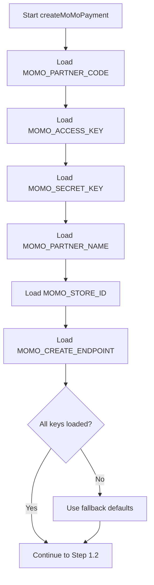
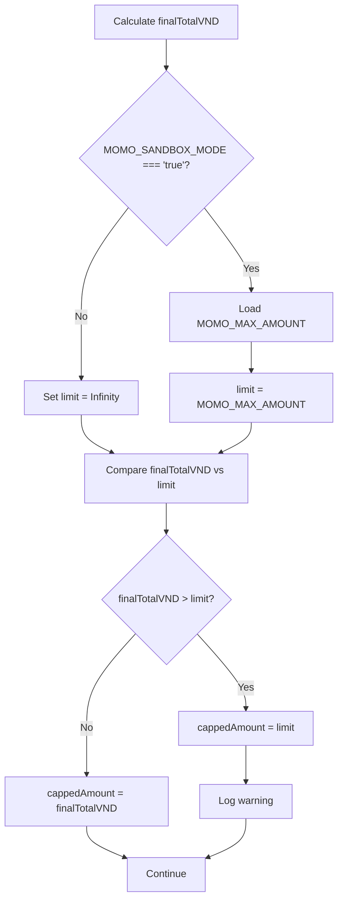
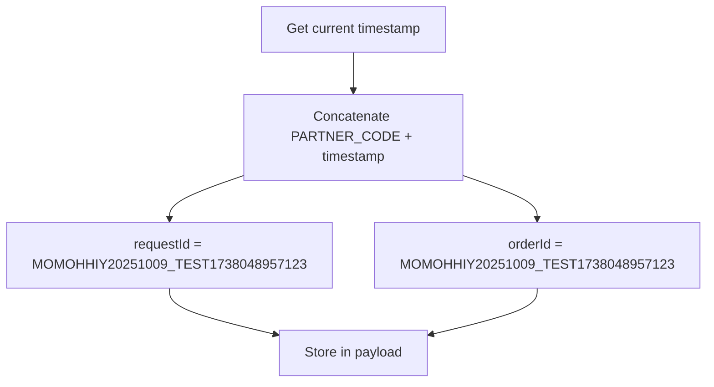
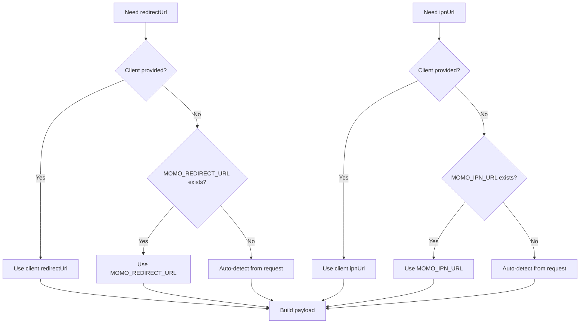
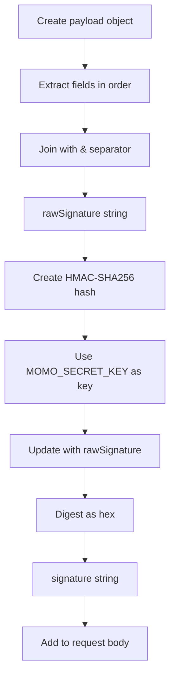
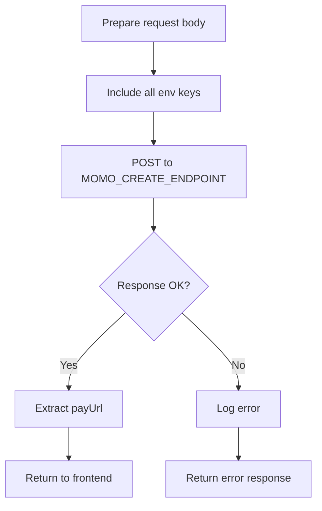
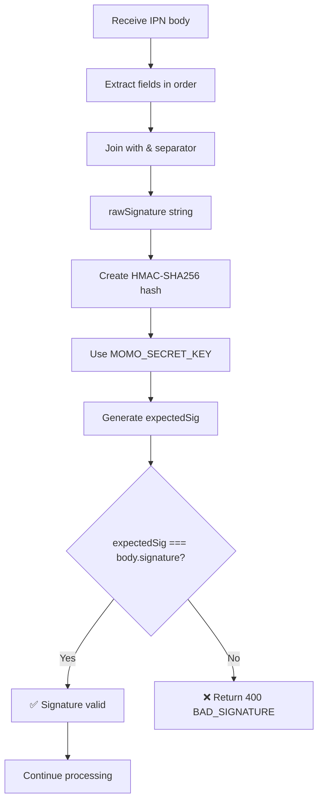
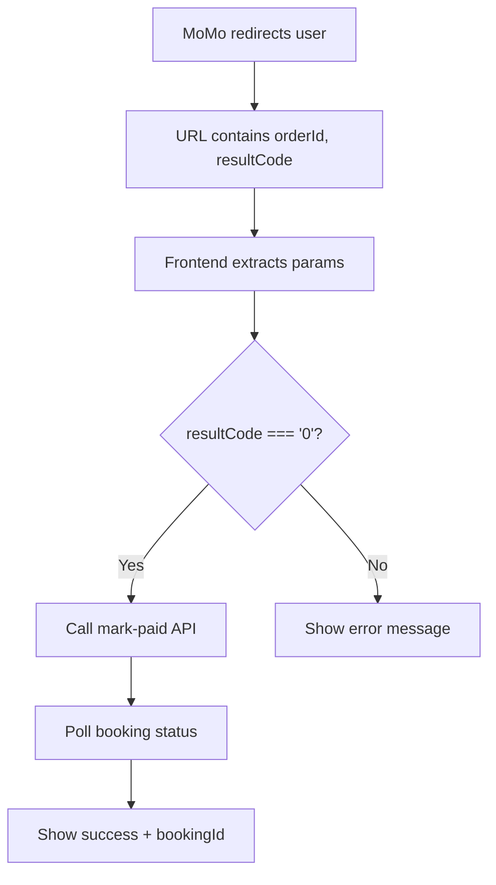

# Luồng Logic Sử Dụng MoMo Environment Keys

## 📋 Tổng quan

Tài liệu này mô tả chi tiết **luồng logic sử dụng các environment variables** trong quá trình tích hợp thanh toán MoMo, từ lúc khởi tạo request đến khi xác thực callback.

---

## 🔑 Danh sách Environment Keys

### File: `touring-be/.env`

```env
# === CREDENTIALS (Xác thực với MoMo) ===
MOMO_PARTNER_CODE=MOMOHHIY20251009_TEST
MOMO_ACCESS_KEY=XXmpwtA8seF2ejOn
MOMO_SECRET_KEY=TcX7IEdUrlBRhuZF6ryVJ839QWXrnzlB

# === BUSINESS INFO (Hiển thị trên MoMo App) ===
MOMO_PARTNER_NAME=Travyy
MOMO_STORE_ID=TravyyStore

# === CONFIGURATION (Cấu hình hệ thống) ===
MOMO_SANDBOX_MODE=false
MOMO_MAX_AMOUNT=10000000

# === ENDPOINTS (URLs giao tiếp) ===
MOMO_REDIRECT_URL=http://localhost:5173/payment/callback
MOMO_IPN_URL=https://webhook.site/b3088a6a-2d17-4f8d-a383-71389a6c600b
MOMO_CREATE_ENDPOINT=https://test-payment.momo.vn/v2/gateway/api/create
```

---

## 🔄 Luồng Logic Chi Tiết

### **PHASE 1: Khởi tạo Payment Request**

#### Bước 1.1: Load Environment Variables

**File**: `touring-be/controller/payment.controller.js`

```javascript
exports.createMoMoPayment = async (req, res) => {
  // 🔑 LOAD CREDENTIALS từ .env
  const partnerCode = process.env.MOMO_PARTNER_CODE || "MOMO";
  const accessKey = process.env.MOMO_ACCESS_KEY || "F8BBA842ECF85";
  const secretKey = process.env.MOMO_SECRET_KEY || "K951B6PE1waDMi640xX08PD3vg6EkVlz";
  
  // 🔑 LOAD BUSINESS INFO
  const partnerName = process.env.MOMO_PARTNER_NAME || "Travyy";
  const storeId = process.env.MOMO_STORE_ID || "TravyyStore";
  
  // 🔑 LOAD ENDPOINT
  const endpoint = process.env.MOMO_CREATE_ENDPOINT || 
    "https://test-payment.momo.vn/v2/gateway/api/create";
  
  console.log("📦 Loaded MoMo Config:", {
    partnerCode,
    partnerName,
    storeId,
    endpoint
  });
  
  // ⚠️ LƯU Ý: secretKey KHÔNG BAO GIỜ log ra console
};
```

**Luồng logic:**


---

#### Bước 1.2: Kiểm tra giới hạn Test Environment

```javascript
// 🔑 LOAD TEST CONFIGURATION
const MOMO_TEST_LIMIT = 
  process.env.MOMO_SANDBOX_MODE === "true"
    ? Number(process.env.MOMO_MAX_AMOUNT) || 10000000
    : Infinity;

// Tính toán số tiền
const finalTotalVND = Math.max(0, totalVND - discountAmount);

// ⚠️ ÁP DỤNG GIỚI HẠN TEST
const cappedAmount = Math.min(finalTotalVND, MOMO_TEST_LIMIT);

if (cappedAmount !== finalTotalVND) {
  console.log(`⚠️ MoMo Test Limit Applied:`, {
    original: finalTotalVND,
    capped: cappedAmount,
    limit: MOMO_TEST_LIMIT,
    reason: "MOMO_SANDBOX_MODE=true"
  });
}
```

**Luồng logic:**


**Ví dụ:**
```javascript
// Case 1: Sandbox mode ON
MOMO_SANDBOX_MODE=true
MOMO_MAX_AMOUNT=10000000
finalTotalVND=15000000
→ cappedAmount=10000000 ✅

// Case 2: Sandbox mode OFF (Production)
MOMO_SANDBOX_MODE=false
finalTotalVND=15000000
→ cappedAmount=15000000 ✅

// Case 3: Sandbox mode ON, amount < limit
MOMO_SANDBOX_MODE=true
MOMO_MAX_AMOUNT=10000000
finalTotalVND=5000000
→ cappedAmount=5000000 ✅
```

---

#### Bước 1.3: Tạo Order ID và Request ID

```javascript
// 🔑 SỬ DỤNG PARTNER_CODE để tạo unique IDs
const now = Date.now();
const requestId = partnerCode + now;  // MOMOHHIY20251009_TEST1738048957123
const orderId = partnerCode + now;    // MOMOHHIY20251009_TEST1738048957123

console.log("🆔 Generated IDs:", {
  requestId,
  orderId,
  timestamp: now,
  partnerCode
});
```

**Luồng logic:**


---

#### Bước 1.4: Load Redirect và IPN URLs

```javascript
// 🔑 LOAD REDIRECT URL (Frontend callback)
const envRedirect = process.env.MOMO_REDIRECT_URL;
const redirectUrl = 
  req.body.redirectUrl ||                                    // Priority 1: Client override
  envRedirect ||                                             // Priority 2: .env
  `${req.protocol}://${req.get("host")}/momo-sandbox`;      // Priority 3: Auto-detect

// 🔑 LOAD IPN URL (Backend callback)
const envIpn = process.env.MOMO_IPN_URL;
const ipnUrl = 
  req.body.ipnUrl ||                                         // Priority 1: Client override
  envIpn ||                                                  // Priority 2: .env
  `${req.protocol}://${req.get("host")}/api/payments/momo/ipn`; // Priority 3: Auto-detect

console.log("🔗 URLs:", {
  redirectUrl,
  ipnUrl,
  source: {
    redirect: req.body.redirectUrl ? "client" : envRedirect ? "env" : "auto",
    ipn: req.body.ipnUrl ? "client" : envIpn ? "env" : "auto"
  }
});
```

**Luồng logic:**


**Ví dụ:**

| Scenario | MOMO_REDIRECT_URL | Client Override | Result |
|----------|-------------------|-----------------|--------|
| Dev (local) | `http://localhost:5173/payment/callback` | - | `http://localhost:5173/payment/callback` |
| Production | `https://travyy.com/payment/callback` | - | `https://travyy.com/payment/callback` |
| Custom | `http://localhost:5173/payment/callback` | `http://custom.com/callback` | `http://custom.com/callback` |

---

#### Bước 1.5: Tạo Signature (HMAC-SHA256)

```javascript
// 🔑 BUILD RAW SIGNATURE STRING
function buildRawSignature(payload) {
  return [
    `accessKey=${payload.accessKey}`,           // 🔑 MOMO_ACCESS_KEY
    `amount=${payload.amount}`,
    `extraData=${payload.extraData}`,
    `ipnUrl=${payload.ipnUrl}`,                 // 🔑 MOMO_IPN_URL
    `orderId=${payload.orderId}`,               // 🔑 PARTNER_CODE + timestamp
    `orderInfo=${payload.orderInfo}`,
    `partnerCode=${payload.partnerCode}`,       // 🔑 MOMO_PARTNER_CODE
    `redirectUrl=${payload.redirectUrl}`,       // 🔑 MOMO_REDIRECT_URL
    `requestId=${payload.requestId}`,           // 🔑 PARTNER_CODE + timestamp
    `requestType=${payload.requestType}`,
  ].join("&");
}

// 🔑 CREATE PAYLOAD
const payload = {
  partnerCode,      // 🔑 MOMO_PARTNER_CODE
  partnerName,      // 🔑 MOMO_PARTNER_NAME
  storeId,          // 🔑 MOMO_STORE_ID
  requestId,
  amount: String(cappedAmount),
  orderId,
  orderInfo: "Thanh toan don tour",
  redirectUrl,      // 🔑 MOMO_REDIRECT_URL
  ipnUrl,           // 🔑 MOMO_IPN_URL
  lang: "vi",
  extraData: "",
  requestType: "captureWallet",
  accessKey         // 🔑 MOMO_ACCESS_KEY
};

// 🔑 GENERATE SIGNATURE
const rawSignature = buildRawSignature(payload);
const signature = crypto
  .createHmac("sha256", secretKey)  // 🔑 MOMO_SECRET_KEY
  .update(rawSignature)
  .digest("hex");

console.log("🔐 Signature Generated:", {
  rawSignature,
  signature,
  secretKeyUsed: secretKey.substring(0, 4) + "****" // Mask for security
});
```

**Luồng logic:**


**Ví dụ Raw Signature:**
```
accessKey=XXmpwtA8seF2ejOn&amount=100000&extraData=&ipnUrl=http://localhost:4000/api/payments/momo/ipn&orderId=MOMOHHIY20251009_TEST1738048957123&orderInfo=Thanh toan don tour&partnerCode=MOMOHHIY20251009_TEST&redirectUrl=http://localhost:5173/payment/callback&requestId=MOMOHHIY20251009_TEST1738048957123&requestType=captureWallet
```

**Signature Output:**
```
a1b2c3d4e5f6g7h8i9j0k1l2m3n4o5p6q7r8s9t0u1v2w3x4y5z6
```

---

#### Bước 1.6: Gọi MoMo API

```javascript
// 🔑 PREPARE REQUEST BODY
const body = {
  partnerCode: payload.partnerCode,    // 🔑 MOMO_PARTNER_CODE
  partnerName: payload.partnerName,    // 🔑 MOMO_PARTNER_NAME
  storeId: payload.storeId,            // 🔑 MOMO_STORE_ID
  requestId: payload.requestId,
  amount: payload.amount,
  orderId: payload.orderId,
  orderInfo: payload.orderInfo,
  redirectUrl: payload.redirectUrl,    // 🔑 MOMO_REDIRECT_URL
  ipnUrl: payload.ipnUrl,              // 🔑 MOMO_IPN_URL
  lang: payload.lang,
  extraData: payload.extraData,
  requestType: payload.requestType,
  signature                            // 🔑 Generated using MOMO_SECRET_KEY
};

// 🔑 CALL MOMO API
const momoRes = await fetch(endpoint, {  // 🔑 MOMO_CREATE_ENDPOINT
  method: "POST",
  headers: { "Content-Type": "application/json" },
  body: JSON.stringify(body)
});

const data = await momoRes.json();

console.log("📡 MoMo API Response:", {
  status: momoRes.status,
  resultCode: data.resultCode,
  payUrl: data.payUrl,
  orderId: data.orderId
});
```

**Luồng logic:**


---

### **PHASE 2: Xử lý IPN Callback**

#### Bước 2.1: Nhận IPN từ MoMo

**File**: `touring-be/controller/payment.controller.js`

```javascript
exports.handleMoMoIPN = async (req, res) => {
  const body = req.body;
  
  console.log("🔔 IPN Received:", {
    orderId: body.orderId,
    resultCode: body.resultCode,
    message: body.message,
    transId: body.transId,
    signature: body.signature
  });
  
  // 🔑 LOAD SECRET KEY để verify
  const secretKey = process.env.MOMO_SECRET_KEY || "K951B6PE1waDMi640xX08PD3vg6EkVlz";
  
  // Continue to Step 2.2...
};
```

---

#### Bước 2.2: Verify Signature

```javascript
// 🔑 BUILD IPN RAW SIGNATURE
function buildIpnRawSignature(p) {
  return [
    `accessKey=${p.accessKey}`,         // 🔑 MOMO_ACCESS_KEY (from IPN body)
    `amount=${p.amount}`,
    `extraData=${p.extraData}`,
    `message=${p.message}`,
    `orderId=${p.orderId}`,
    `orderInfo=${p.orderInfo}`,
    `orderType=${p.orderType}`,
    `partnerCode=${p.partnerCode}`,     // 🔑 MOMO_PARTNER_CODE (from IPN body)
    `payType=${p.payType}`,
    `requestId=${p.requestId}`,
    `responseTime=${p.responseTime}`,
    `resultCode=${p.resultCode}`,
    `transId=${p.transId}`
  ].join("&");
}

// 🔑 VERIFY SIGNATURE
const raw = buildIpnRawSignature(body);
const expectedSig = crypto
  .createHmac("sha256", secretKey)  // 🔑 MOMO_SECRET_KEY
  .update(raw)
  .digest("hex");

if (expectedSig !== body.signature) {
  console.error("❌ Signature Mismatch:", {
    expected: expectedSig,
    received: body.signature,
    rawSignature: raw
  });
  return res.status(400).json({ error: "BAD_SIGNATURE" });
}

console.log("✅ Signature Verified");
```

**Luồng logic:**


**Ví dụ IPN Raw Signature:**
```
accessKey=XXmpwtA8seF2ejOn&amount=100000&extraData=&message=Successful&orderId=MOMOHHIY20251009_TEST1738048957123&orderInfo=Thanh toan don tour&orderType=momo_wallet&partnerCode=MOMOHHIY20251009_TEST&payType=qr&requestId=MOMOHHIY20251009_TEST1738048957123&responseTime=1738048960000&resultCode=0&transId=2147483647
```

---

### **PHASE 3: Frontend Redirect**

#### Bước 3.1: User redirect về frontend

**URL Format:**
```
http://localhost:5173/payment/callback?orderId=MOMOHHIY20251009_TEST1738048957123&resultCode=0&message=Successful&transId=2147483647&signature=abc123...
```

**File**: `touring-fe/src/pages/PaymentCallback.jsx`

```javascript
useEffect(() => {
  const momoOrderId = searchParams.get('orderId');
  const momoResultCode = searchParams.get('resultCode');
  
  console.log("🔙 Redirect from MoMo:", {
    orderId: momoOrderId,
    resultCode: momoResultCode,
    redirectUrl: window.location.href
  });
  
  // ⚠️ LƯU Ý: Frontend KHÔNG cần verify signature
  // Backend đã verify qua IPN callback
  
  if (momoResultCode === '0') {
    // Success flow...
  } else {
    // Failed flow...
  }
}, [searchParams]);
```

**Luồng logic:**


---

## 📊 Bảng Tổng Hợp Sử Dụng Keys

| Environment Key | Phase 1 (Create) | Phase 2 (IPN) | Phase 3 (Redirect) | Mục đích |
|----------------|------------------|---------------|-------------------|----------|
| `MOMO_PARTNER_CODE` | ✅ Tạo orderId/requestId | ✅ Verify trong IPN body | ❌ | Định danh đối tác |
| `MOMO_ACCESS_KEY` | ✅ Trong payload | ✅ Verify trong IPN body | ❌ | Xác thực request |
| `MOMO_SECRET_KEY` | ✅ Tạo signature | ✅ Verify signature | ❌ | Bảo mật giao dịch |
| `MOMO_PARTNER_NAME` | ✅ Hiển thị trên MoMo | ❌ | ❌ | Branding |
| `MOMO_STORE_ID` | ✅ Trong payload | ❌ | ❌ | Định danh cửa hàng |
| `MOMO_SANDBOX_MODE` | ✅ Kiểm tra giới hạn | ❌ | ❌ | Môi trường test |
| `MOMO_MAX_AMOUNT` | ✅ Giới hạn số tiền | ❌ | ❌ | Bảo vệ test wallet |
| `MOMO_REDIRECT_URL` | ✅ Trong payload | ❌ | ✅ Đích đến sau thanh toán | URL callback frontend |
| `MOMO_IPN_URL` | ✅ Trong payload | ✅ MoMo gọi đến | ❌ | URL callback backend |
| `MOMO_CREATE_ENDPOINT` | ✅ API endpoint | ❌ | ❌ | Gọi MoMo API |

---

## 🔐 Security Best Practices

### 1. Bảo vệ SECRET_KEY

```javascript
// ❌ KHÔNG BAO GIỜ làm thế này
console.log("Secret Key:", process.env.MOMO_SECRET_KEY);

// ✅ Nếu cần log, mask nó
console.log("Secret Key:", process.env.MOMO_SECRET_KEY?.substring(0, 4) + "****");
```

### 2. Validate tất cả env keys

```javascript
function validateMoMoConfig() {
  const required = [
    'MOMO_PARTNER_CODE',
    'MOMO_ACCESS_KEY',
    'MOMO_SECRET_KEY'
  ];
  
  const missing = required.filter(key => !process.env[key]);
  
  if (missing.length > 0) {
    throw new Error(`Missing required MoMo config: ${missing.join(', ')}`);
  }
  
  console.log("✅ All MoMo config keys validated");
}

// Call on server startup
validateMoMoConfig();
```

### 3. Sử dụng fallback an toàn

```javascript
// ✅ Fallback cho non-critical keys
const partnerName = process.env.MOMO_PARTNER_NAME || "DefaultStore";

// ❌ KHÔNG fallback cho critical keys
const secretKey = process.env.MOMO_SECRET_KEY; // No fallback!
if (!secretKey) {
  throw new Error("MOMO_SECRET_KEY is required");
}
```

---

## 🎯 Checklist Triển khai

### Development Environment
- [ ] Copy `.env.example` thành `.env`
- [ ] Điền đầy đủ MoMo credentials
- [ ] Set `MOMO_SANDBOX_MODE=true`
- [ ] Set `MOMO_MAX_AMOUNT=10000000`
- [ ] Cấu hình `MOMO_IPN_URL` với ngrok hoặc webhook.site
- [ ] Test tạo payment
- [ ] Test IPN callback
- [ ] Test redirect flow

### Production Environment
- [ ] Lấy credentials production từ MoMo
- [ ] Set `MOMO_SANDBOX_MODE=false`
- [ ] Remove `MOMO_MAX_AMOUNT` hoặc set cao hơn
- [ ] Cấu hình `MOMO_REDIRECT_URL` với domain production
- [ ] Cấu hình `MOMO_IPN_URL` với domain production
- [ ] Update `MOMO_CREATE_ENDPOINT` sang production endpoint
- [ ] Test end-to-end trên production
- [ ] Monitor logs và errors

---

## 📞 Troubleshooting theo Key

### MOMO_SECRET_KEY sai
**Triệu chứng:**
```
❌ Signature Mismatch
Expected: abc123...
Received: xyz789...
```

**Giải pháp:**
1. Kiểm tra lại SECRET_KEY trên MoMo Developer Portal
2. Đảm bảo không có space hoặc newline
3. Copy lại chính xác

### MOMO_IPN_URL không public
**Triệu chứng:**
```
⚠️ IPN not received
Session status stuck at 'pending'
```

**Giải pháp:**
1. Sử dụng ngrok: `ngrok http 4000`
2. Hoặc webhook.site cho testing
3. Update `MOMO_IPN_URL` với public URL

### MOMO_MAX_AMOUNT quá thấp
**Triệu chứng:**
```
⚠️ Amount capped from 15,000,000 to 10,000,000 VNĐ
```

**Giải pháp:**
1. Tăng `MOMO_MAX_AMOUNT` nếu cần
2. Hoặc set `MOMO_SANDBOX_MODE=false` cho production

---

**Last Updated**: 2024-01-27  
**Version**: 1.0.0  
**Author**: TRAVYY Development Team
