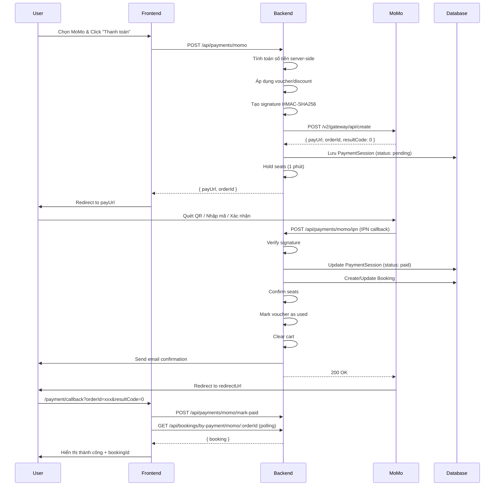

# Hướng dẫn Tích hợp Thanh toán MoMo 

## 📋 Mục lục
1. [Tổng quan](#tổng-quan)
2. [Cấu hình Environment Variables](#cấu-hình-environment-variables)
3. [Cách tạo tài khoản MoMo Test](#cách-tạo-tài-khoản-momo-test)
4. [Kiến trúc Backend](#kiến-trúc-backend)
5. [Kiến trúc Frontend](#kiến-trúc-frontend)
6. [Flow thanh toán](#flow-thanh-toán)
7. [API Endpoints](#api-endpoints)
8. [Testing](#testing)
9. [Troubleshooting](#troubleshooting)

---

## 🎯 Tổng quan

TRAVYY sử dụng **MoMo Payment Gateway v2** để xử lý thanh toán tour du lịch. Hệ thống hỗ trợ:
- ✅ Thanh toán từ giỏ hàng (cart mode)
- ✅ Mua ngay (buy-now mode)
- ✅ Thanh toán lại đơn hàng thất bại (retry-payment mode)
- ✅ Áp dụng voucher/promotion
- ✅ Giữ chỗ tạm thời (seat holding)
- ✅ IPN callback tự động
- ✅ Polling status

---

## 🔑 Cấu hình Environment Variables

### File: `touring-be/.env`

```env
# MoMo Credentials - TEST Environment
MOMO_PARTNER_CODE=MOMOHHIY20251009_TEST
MOMO_ACCESS_KEY=XXmpwtA8seF2ejOn
MOMO_SECRET_KEY=TcX7IEdUrlBRhuZF6ryVJ839QWXrnzlB
MOMO_PARTNER_NAME=Travyy
MOMO_STORE_ID=TravyyStore

# MoMo Configuration
MOMO_SANDBOX_MODE=false
MOMO_MAX_AMOUNT=10000000
MOMO_REDIRECT_URL=http://localhost:5173/payment/callback
MOMO_IPN_URL=https://webhook.site/b3088a6a-2d17-4f8d-a383-71389a6c600b
MOMO_CREATE_ENDPOINT=https://test-payment.momo.vn/v2/gateway/api/create
```

### 📝 Giải thích các biến:

| Biến | Mô tả | Ví dụ |
|------|-------|-------|
| `MOMO_PARTNER_CODE` | Mã đối tác do MoMo cấp | `MOMOHHIY20251009_TEST` |
| `MOMO_ACCESS_KEY` | Access key để xác thực | `XXmpwtA8seF2ejOn` |
| `MOMO_SECRET_KEY` | Secret key để ký signature | `TcX7IEdUrlBRhuZF6ryVJ839QWXrnzlB` |
| `MOMO_PARTNER_NAME` | Tên hiển thị trên MoMo app | `Travyy` |
| `MOMO_STORE_ID` | Mã cửa hàng | `TravyyStore` |
| `MOMO_SANDBOX_MODE` | Bật/tắt giới hạn test | `false` |
| `MOMO_MAX_AMOUNT` | Số tiền tối đa (VNĐ) | `10000000` (10 triệu) |
| `MOMO_REDIRECT_URL` | URL redirect sau thanh toán | `http://localhost:5173/payment/callback` |
| `MOMO_IPN_URL` | URL nhận IPN callback | `https://webhook.site/...` |
| `MOMO_CREATE_ENDPOINT` | API endpoint tạo payment | `https://test-payment.momo.vn/v2/gateway/api/create` |

> ⚠️ **Lưu ý**: 
> - Môi trường TEST có giới hạn **10,000,000 VNĐ/giao dịch**
> - `MOMO_IPN_URL` phải là URL public (dùng webhook.site hoặc ngrok cho local dev)

---

## 🏗️ Cách tạo tài khoản MoMo Test

### Bước 1: Đăng ký MoMo Business

1. Truy cập: https://business.momo.vn/
2. Chọn **"Đăng ký"** → **"Doanh nghiệp"**
3. Điền thông tin:
   - Tên doanh nghiệp
   - Mã số thuế
   - Email liên hệ
   - Số điện thoại

### Bước 2: Đăng ký MoMo Developer

1. Truy cập: https://developers.momo.vn/
2. Đăng nhập bằng tài khoản MoMo Business
3. Vào **"Quản lý ứng dụng"** → **"Tạo ứng dụng mới"**
4. Chọn loại tích hợp: **"Payment Gateway"**

### Bước 3: Lấy thông tin xác thực

Sau khi tạo app, bạn sẽ nhận được:

```
Partner Code: MOMOXXXX20XXXXXX_TEST
Access Key: XXXXXXXXXXXXXXXX
Secret Key: XXXXXXXXXXXXXXXXXXXXXXXXXXXXXXXX
```

### Bước 4: Cấu hình Webhook (IPN URL)

#### Option 1: Sử dụng webhook.site (Cho testing)
1. Truy cập: https://webhook.site/
2. Copy URL duy nhất (ví dụ: `https://webhook.site/b3088a6a-2d17-4f8d-a383-71389a6c600b`)
3. Paste vào `MOMO_IPN_URL`

#### Option 2: Sử dụng ngrok (Cho local development)
```bash
# Cài đặt ngrok
npm install -g ngrok

# Chạy ngrok
ngrok http 4000

# Copy URL forwarding (ví dụ: https://abc123.ngrok.io)
# IPN URL sẽ là: https://abc123.ngrok.io/api/payments/momo/ipn
```

### Bước 5: Test với MoMo App

1. Tải **MoMo App** trên điện thoại
2. Đăng ký tài khoản test
3. Nạp tiền test (MoMo sẽ cấp số dư ảo)
4. Quét QR code hoặc nhập số điện thoại để thanh toán

---

## 🏛️ Kiến trúc Backend

### 1. Models

#### PaymentSession Model
**File**: [touring-be/models/PaymentSession.js](file:///d:/FPT/Ky5/SWP391/TRAVYY-touring-website/touring-be/models/PaymentSession.js)

```javascript
{
  userId: ObjectId,           // User thực hiện thanh toán
  provider: "momo" | "paypal", // Nhà cung cấp
  orderId: String,            // Mã đơn hàng (unique)
  requestId: String,          // Mã request
  amount: Number,             // Số tiền (VNĐ)
  status: "pending" | "paid" | "failed" | "cancelled" | "expired",
  mode: "cart" | "buy-now" | "retry-payment",
  items: [{
    name: String,
    price: Number,
    tourId: ObjectId,
    meta: {
      date: String,
      adults: Number,
      children: Number,
      unitPriceAdult: Number,
      unitPriceChild: Number
    }
  }],
  voucherCode: String,        // Mã voucher
  discountAmount: Number,     // Số tiền giảm
  rawCreateResponse: Object,  // Response từ MoMo
  paidAt: Date,
  transId: String,            // Transaction ID từ MoMo
  payType: String,
  message: String,
  resultCode: String
}
```

#### Booking Model
**File**: [touring-be/models/Bookings.js](file:///d:/FPT/Ky5/SWP391/TRAVYY-touring-website/touring-be/models/Bookings.js)

```javascript
{
  userId: ObjectId,
  items: [{
    tourId: ObjectId,
    name: String,
    image: String,
    date: String,
    adults: Number,
    children: Number,
    unitPriceAdult: Number,
    unitPriceChild: Number
  }],
  totalAmount: Number,
  originalAmount: Number,
  discountAmount: Number,
  currency: "VND",
  voucherCode: String,
  payment: {
    provider: "momo" | "paypal",
    orderId: String,
    status: "pending" | "completed" | "failed",
    paidAt: Date,
    transactionId: String,
    providerData: Object
  },
  status: "pending" | "paid" | "cancelled",
  bookingCode: String
}
```

### 2. Controllers

#### Payment Controller
**File**: [touring-be/controller/payment.controller.js](file:///d:/FPT/Ky5/SWP391/TRAVYY-touring-website/touring-be/controller/payment.controller.js)

**Các hàm chính:**

##### `createMoMoPayment(req, res)`
Tạo phiên thanh toán MoMo

```javascript
// Input
{
  mode: "cart" | "buy-now" | "retry-payment",
  item: { tourId, date, adults, children }, // Cho buy-now
  retryItems: [...],                         // Cho retry-payment
  retryBookingId: String,                    // Cho retry-payment
  discountAmount: Number,
  promotionCode: String
}

// Output
{
  payUrl: String,      // URL redirect đến MoMo
  deeplink: String,    // Deep link cho MoMo app
  orderId: String,
  requestId: String,
  resultCode: 0
}
```

**Flow xử lý:**
1. Xác thực user
2. Tính toán số tiền từ server (không tin client)
3. Áp dụng discount/voucher
4. Giới hạn số tiền test (10 triệu VNĐ)
5. Tạo signature HMAC-SHA256
6. Gọi MoMo API
7. Lưu PaymentSession
8. Giữ chỗ tạm thời (hold seats) trong 1 phút
9. Trả về payUrl

##### `handleMoMoIPN(req, res)`
Xử lý IPN callback từ MoMo

```javascript
// Input (từ MoMo)
{
  partnerCode: String,
  orderId: String,
  requestId: String,
  amount: String,
  orderInfo: String,
  orderType: String,
  transId: String,
  resultCode: String,  // "0" = success
  message: String,
  payType: String,
  responseTime: String,
  extraData: String,
  signature: String
}
```

**Flow xử lý:**
1. Verify signature
2. Tìm PaymentSession
3. Nếu `resultCode === "0"`:
   - Đánh dấu session = "paid"
   - Confirm seats (giữ chỗ vĩnh viễn)
   - Tạo/cập nhật Booking
   - Đánh dấu voucher đã sử dụng
   - Gửi email xác nhận
   - Xóa items khỏi cart
4. Nếu `resultCode !== "0"`:
   - Đánh dấu session = "failed"
   - Release seats
   - Restore cart
5. Trả về `200 OK` (quan trọng để MoMo không retry)

##### `markMoMoPaid(req, res)`
Endpoint cho frontend gọi sau khi redirect

```javascript
// Input
{
  orderId: String,
  resultCode: String,
  message: String
}

// Output
{
  success: Boolean,
  status: "paid" | "failed",
  bookingId: String,
  message: String
}
```

##### `getMoMoSessionStatus(req, res)`
Polling endpoint để check trạng thái

```javascript
// GET /api/payments/momo/session/:orderId

// Output
{
  orderId: String,
  status: "pending" | "paid" | "failed",
  paidAt: Date,
  amount: Number,
  resultCode: String,
  message: String
}
```

### 3. Helpers

#### Payment Helpers
**File**: [touring-be/utils/paymentHelpers.js](file:///d:/FPT/Ky5/SWP391/TRAVYY-touring-website/touring-be/utils/paymentHelpers.js)

```javascript
// Tạo booking từ session
createBookingFromSession(session, additionalData)

// Đánh dấu booking đã thanh toán
markBookingAsPaid(orderId, paymentData)

// Đánh dấu booking thất bại
markBookingAsFailed(orderId, failureData)

// Xóa cart sau thanh toán
clearCartAfterPayment(userId)

// Tính tổng tiền
calculateTotal(items)

// Chuyển đổi tiền tệ
toUSD(vnd)
toVND(usd)
```

#### Seat Management
**File**: [touring-be/controller/payment.controller.js](file:///d:/FPT/Ky5/SWP391/TRAVYY-touring-website/touring-be/controller/payment.controller.js#L76-L216)

```javascript
// Giữ chỗ tạm thời (1 phút)
holdSeatsForPayment(session)

// Giải phóng chỗ
releaseSeatsForPayment(session)

// Xác nhận giữ chỗ vĩnh viễn
confirmSeatsForPayment(session)

// Khôi phục cart khi thất bại
restoreCartFromPaymentSession(session)
```

### 4. Routes

**File**: [touring-be/routes/payment.routes.js](file:///d:/FPT/Ky5/SWP391/TRAVYY-touring-website/touring-be/routes/payment.routes.js)

```javascript
// Tạo payment (cần auth)
POST /api/payments/momo

// IPN callback (public)
POST /api/payments/momo/ipn

// Mark paid (cần auth)
POST /api/payments/momo/mark-paid

// Poll status (cần auth)
GET /api/payments/momo/session/:orderId

// Get booking by payment (cần auth)
GET /api/payments/booking/:provider/:orderId

// Retry payment (cần auth)
POST /api/payments/retry/:bookingId
```

---

## 💻 Kiến trúc Frontend

### 1. Checkout Form Component

**File**: [touring-fe/src/components/CheckOutForm.jsx](file:///d:/FPT/Ky5/SWP391/TRAVYY-touring-website/touring-fe/src/components/CheckOutForm.jsx)

**Props:**
```javascript
{
  mode: "cart" | "buy-now" | "retry-payment",
  buyNowItem: { tourId, date, adults, children },
  retryPaymentItems: [...],
  retryBookingId: String,
  summaryItems: [...],
  totalAmount: Number,
  onVoucherChange: Function
}
```

**State:**
```javascript
{
  selectedPayment: "momo" | "paypal" | "",
  userInfo: {
    name, email, phone,
    provinceId, provinceName,
    wardId, wardName,
    addressLine
  },
  appliedVoucher: Object,
  discountAmount: Number,
  finalTotal: Number,
  isProcessingPayment: Boolean
}
```

**Xử lý thanh toán MoMo:**

```javascript
const handlePayment = async () => {
  if (selectedPayment === "momo") {
    setIsProcessingPayment(true);
    
    // Tính số tiền sau discount
    let amount = Number(finalTotal);
    
    // Prepare payload
    const data = await withAuth('/api/payments/momo', {
      method: 'POST',
      body: JSON.stringify({
        amount,
        orderInfo: 'Thanh toán đơn tour Travyy',
        redirectUrl: `${window.location.origin}/payment/callback`,
        mode,
        ...(mode === 'buy-now' && { item: buyNowItem }),
        ...(mode === 'retry-payment' && { 
          retryItems: retryPaymentItems,
          retryBookingId 
        }),
        items: summaryItems,
        promotionCode: appliedVoucher?.code,
        discountAmount
      })
    });
    
    // Redirect to MoMo
    if (data?.payUrl) {
      window.location.href = data.payUrl;
    }
  }
};
```

**UI Elements:**

```jsx
{/* MoMo Payment Option */}
<div
  onClick={() => setSelectedPayment("momo")}
  className={`p-4 border-2 rounded-xl cursor-pointer ${
    selectedPayment === "momo" 
      ? "border-pink-500 bg-pink-50" 
      : "border-gray-200"
  }`}
>
  <div className="flex items-center justify-between">
    <div className="flex items-center gap-3">
      <div className="w-5 h-5 rounded-full border-2">
        {selectedPayment === "momo" && (
          <div className="w-3 h-3 rounded-full bg-pink-500" />
        )}
      </div>
      <Wallet className="w-6 h-6" />
      <span>Ví MoMo</span>
    </div>
    
  </div>
  
  {/* Test Warning */}
  {selectedPayment === "momo" && totalAmount > 10000000 && (
    <div className="mt-3 p-3 bg-yellow-50 border border-yellow-200">
      <p>⚠️ MoMo test chỉ hỗ trợ tối đa 10,000,000 VNĐ/giao dịch</p>
    </div>
  )}
</div>
```

### 2. Payment Callback Page

**File**: [touring-fe/src/pages/PaymentCallback.jsx](file:///d:/FPT/Ky5/SWP391/TRAVYY-touring-website/touring-fe/src/pages/PaymentCallback.jsx)

**URL Parameters từ MoMo:**
```
?orderId=MOMOXXXX1234567890
&resultCode=0
&message=Successful
&transId=2147483647
&amount=100000
&signature=xxx
```

**Flow xử lý:**

```javascript
useEffect(() => {
  const momoOrderId = searchParams.get('orderId');
  const momoResultCode = searchParams.get('resultCode');
  const momoMessage = searchParams.get('message');
  
  if (momoOrderId) {
    const success = momoResultCode === '0';
    
    if (success) {
      // Step 1: Call mark-paid
      await fetch(`${API_BASE}/api/payments/momo/mark-paid`, {
        method: 'POST',
        body: JSON.stringify({ 
          orderId: momoOrderId, 
          resultCode: momoResultCode 
        })
      });
      
      // Step 2: Poll booking creation
      const poll = async () => {
        const r = await fetch(
          `${API_BASE}/api/bookings/by-payment/momo/${momoOrderId}`
        );
        
        if (r.ok) {
          const d = await r.json();
          if (d?.booking?._id) {
            setStatus('success');
            setBookingId(d.booking._id);
            await refreshCart(); // Xóa items khỏi cart
            return;
          }
        }
        
        // Retry sau 2s
        if (attempts < 15) setTimeout(poll, 2000);
      };
      
      poll();
    } else {
      setStatus('error');
      setMessage(momoMessage);
    }
  }
}, [searchParams]);
```

**UI States:**

```jsx
{/* Processing */}
{status === "processing" && (
  <>
    <Loader2 className="animate-spin" />
    <h2>Đang xử lý</h2>
    <p>{message}</p>
  </>
)}

{/* Success */}
{status === "success" && (
  <>
    <CheckCircle2 className="text-green-500" />
    <h2>Thanh toán thành công!</h2>
    <p>Mã đặt chỗ: {bookingId}</p>
    <button onClick={() => navigate("/profile/booking-history")}>
      Xem vé của tôi
    </button>
  </>
)}

{/* Error */}
{status === "error" && (
  <>
    <XCircle className="text-red-500" />
    <h2>Thất bại</h2>
    <p>{message}</p>
    <button onClick={() => navigate("/shoppingcarts")}>
      Quay lại giỏ hàng
    </button>
  </>
)}
```

---

## 🔄 Flow thanh toán

### Flow tổng quan



### Flow chi tiết từng bước

#### 1. User chọn MoMo và click "Thanh toán"

**Frontend** (`CheckOutForm.jsx`):
```javascript
const handlePayment = async () => {
  setIsProcessingPayment(true);
  
  const payload = {
    amount: finalTotal,
    mode: "cart", // hoặc "buy-now", "retry-payment"
    items: summaryItems,
    promotionCode: appliedVoucher?.code,
    discountAmount: discountAmount
  };
  
  const data = await withAuth('/api/payments/momo', {
    method: 'POST',
    body: JSON.stringify(payload)
  });
  
  window.location.href = data.payUrl;
};
```

#### 2. Backend tạo payment request

**Backend** (`payment.controller.js`):
```javascript
exports.createMoMoPayment = async (req, res) => {
  // 1. Xác thực user
  const userId = req.user?.sub;
  
  // 2. Tính toán số tiền từ server (KHÔNG TIN CLIENT)
  const { items, totalVND } = await buildMoMoCharge(userId, {
    mode: req.body.mode,
    item: req.body.item,
    retryItems: req.body.retryItems
  });
  
  // 3. Áp dụng discount
  const discountAmount = Number(req.body.discountAmount) || 0;
  const finalTotalVND = Math.max(0, totalVND - discountAmount);
  
  // 4. Giới hạn test (10 triệu VNĐ)
  const cappedAmount = Math.min(finalTotalVND, 10000000);
  
  // 5. Tạo signature
  const orderId = `${partnerCode}${Date.now()}`;
  const payload = {
    partnerCode,
    amount: String(cappedAmount),
    orderId,
    orderInfo: "Thanh toan don tour",
    redirectUrl: process.env.MOMO_REDIRECT_URL,
    ipnUrl: process.env.MOMO_IPN_URL,
    requestType: "captureWallet",
    accessKey
  };
  
  const rawSignature = buildRawSignature(payload);
  const signature = crypto
    .createHmac("sha256", secretKey)
    .update(rawSignature)
    .digest("hex");
  
  // 6. Gọi MoMo API
  const momoRes = await fetch(endpoint, {
    method: "POST",
    headers: { "Content-Type": "application/json" },
    body: JSON.stringify({ ...payload, signature })
  });
  
  const data = await momoRes.json();
  
  // 7. Lưu PaymentSession
  const session = await PaymentSession.create({
    userId,
    provider: "momo",
    orderId,
    amount: cappedAmount,
    status: "pending",
    mode: req.body.mode,
    items,
    voucherCode: req.body.promotionCode,
    discountAmount,
    rawCreateResponse: data
  });
  
  // 8. Hold seats (1 phút)
  await holdSeatsForPayment(session);
  
  // 9. Trả về payUrl
  res.json({
    payUrl: data.payUrl,
    orderId,
    resultCode: data.resultCode
  });
};
```

#### 3. User thanh toán trên MoMo

- User quét QR code hoặc nhập số điện thoại
- Xác nhận thanh toán trên MoMo app
- MoMo xử lý giao dịch

#### 4. MoMo gửi IPN callback

**MoMo** → **Backend** (`POST /api/payments/momo/ipn`):

```javascript
exports.handleMoMoIPN = async (req, res) => {
  const body = req.body;
  
  // 1. Verify signature
  const raw = buildIpnRawSignature(body);
  const expectedSig = crypto
    .createHmac("sha256", secretKey)
    .update(raw)
    .digest("hex");
  
  if (expectedSig !== body.signature) {
    return res.status(400).json({ error: "BAD_SIGNATURE" });
  }
  
  // 2. Tìm PaymentSession
  const session = await PaymentSession.findOne({ 
    orderId: body.orderId 
  });
  
  if (!session) {
    return res.status(404).json({ error: "SESSION_NOT_FOUND" });
  }
  
  // 3. Xử lý kết quả
  if (body.resultCode === "0") {
    // SUCCESS
    session.status = "paid";
    session.paidAt = new Date();
    session.transId = body.transId;
    await session.save();
    
    // Confirm seats
    await confirmSeatsForPayment(session);
    
    // Tạo booking
    const booking = await createBookingFromSession(session, {
      ipn: body,
      markPaid: true
    });
    
    // Mark voucher as used
    if (session.voucherCode) {
      await Promotion.findOneAndUpdate(
        { code: session.voucherCode },
        { $inc: { usageCount: 1 } }
      );
      
      await User.findByIdAndUpdate(session.userId, {
        $addToSet: {
          usedPromotions: {
            promotionId: promotion._id,
            code: promotion.code,
            usedAt: new Date()
          }
        }
      });
    }
    
    // Clear cart
    await clearCartAfterPayment(session.userId);
    
    // Send email
    const user = await User.findById(session.userId);
    await sendPaymentSuccessNotification({
      email: user.email,
      amount: booking.totalAmount,
      bookingCode: booking.bookingCode
    });
    
  } else {
    // FAILED
    session.status = "failed";
    await session.save();
    
    // Release seats
    await releaseSeatsForPayment(session);
    
    // Restore cart
    await restoreCartFromPaymentSession(session);
  }
  
  // 4. QUAN TRỌNG: Trả về 200 OK
  res.json({ message: "OK" });
};
```

#### 5. User redirect về frontend

**MoMo** → **Frontend** (`/payment/callback?orderId=xxx&resultCode=0`):

```javascript
useEffect(() => {
  const momoOrderId = searchParams.get('orderId');
  const momoResultCode = searchParams.get('resultCode');
  
  if (momoOrderId && momoResultCode === '0') {
    // Step 1: Call mark-paid (đảm bảo session được đánh dấu)
    await fetch(`${API_BASE}/api/payments/momo/mark-paid`, {
      method: 'POST',
      body: JSON.stringify({ 
        orderId: momoOrderId, 
        resultCode: momoResultCode 
      })
    });
    
    // Step 2: Poll booking (vì IPN có thể chậm hơn redirect)
    let attempts = 0;
    const poll = async () => {
      attempts++;
      const r = await fetch(
        `${API_BASE}/api/bookings/by-payment/momo/${momoOrderId}`
      );
      
      if (r.ok) {
        const d = await r.json();
        if (d?.booking?._id) {
          setStatus('success');
          setBookingId(d.booking._id);
          await refreshCart();
          return;
        }
      }
      
      if (attempts < 15) {
        setTimeout(poll, 2000);
      }
    };
    
    poll();
  }
}, [searchParams]);
```

---

## 📡 API Endpoints

### 1. Create MoMo Payment

```http
POST /api/payments/momo
Authorization: Bearer {token}
Content-Type: application/json

{
  "mode": "cart",
  "amount": 500000,
  "orderInfo": "Thanh toan don tour",
  "redirectUrl": "http://localhost:5173/payment/callback",
  "items": [
    {
      "name": "Tour Đà Lạt 3N2Đ",
      "price": 500000,
      "tourId": "60d5ec49f1b2c8b1f8e4e1a1"
    }
  ],
  "promotionCode": "SUMMER2024",
  "discountAmount": 50000
}
```

**Response:**
```json
{
  "payUrl": "https://test-payment.momo.vn/gw_payment/payment/qr?partnerCode=...",
  "deeplink": "momo://app?action=payment&...",
  "orderId": "MOMOHHIY202510091234567890",
  "requestId": "MOMOHHIY202510091234567890",
  "resultCode": 0
}
```

### 2. MoMo IPN Callback

```http
POST /api/payments/momo/ipn
Content-Type: application/json

{
  "partnerCode": "MOMOHHIY20251009_TEST",
  "orderId": "MOMOHHIY202510091234567890",
  "requestId": "MOMOHHIY202510091234567890",
  "amount": "500000",
  "orderInfo": "Thanh toan don tour",
  "orderType": "momo_wallet",
  "transId": "2147483647",
  "resultCode": "0",
  "message": "Successful.",
  "payType": "qr",
  "responseTime": "1234567890",
  "extraData": "",
  "signature": "abc123..."
}
```

**Response:**
```json
{
  "message": "OK"
}
```

### 3. Mark MoMo Paid

```http
POST /api/payments/momo/mark-paid
Authorization: Bearer {token}
Content-Type: application/json

{
  "orderId": "MOMOHHIY202510091234567890",
  "resultCode": "0",
  "message": "Successful"
}
```

**Response:**
```json
{
  "success": true,
  "status": "paid",
  "bookingId": "60d5ec49f1b2c8b1f8e4e1a1",
  "message": "Thanh toán thành công!"
}
```

### 4. Get MoMo Session Status

```http
GET /api/payments/momo/session/:orderId
Authorization: Bearer {token}
```

**Response:**
```json
{
  "orderId": "MOMOHHIY202510091234567890",
  "status": "paid",
  "paidAt": "2024-01-27T14:30:00.000Z",
  "amount": 500000,
  "resultCode": "0",
  "message": "Successful"
}
```

### 5. Get Booking by Payment

```http
GET /api/payments/booking/momo/:orderId
Authorization: Bearer {token}
```

**Response:**
```json
{
  "success": true,
  "booking": {
    "_id": "60d5ec49f1b2c8b1f8e4e1a1",
    "bookingCode": "60D5EC49",
    "userId": "60d5ec49f1b2c8b1f8e4e1a0",
    "items": [...],
    "totalAmount": 450000,
    "originalAmount": 500000,
    "discountAmount": 50000,
    "currency": "VND",
    "voucherCode": "SUMMER2024",
    "payment": {
      "provider": "momo",
      "orderId": "MOMOHHIY202510091234567890",
      "status": "completed",
      "paidAt": "2024-01-27T14:30:00.000Z",
      "transactionId": "2147483647"
    },
    "status": "paid"
  }
}
```

### 6. Retry Payment

```http
POST /api/payments/retry/:bookingId
Authorization: Bearer {token}
```

**Response:**
```json
{
  "success": true,
  "sessionId": "60d5ec49f1b2c8b1f8e4e1a2",
  "provider": "momo",
  "amount": 450000,
  "currency": "VND",
  "items": [...]
}
```

---

## 🧪 Testing

### 1. Test với MoMo Sandbox

#### Thông tin test:
- **Số điện thoại test**: 0909000000
- **OTP**: 123456
- **Số dư test**: 10,000,000 VNĐ

#### Test cases:

##### ✅ Test thanh toán thành công
```bash
# 1. Tạo payment
curl -X POST http://localhost:4000/api/payments/momo \
  -H "Authorization: Bearer YOUR_TOKEN" \
  -H "Content-Type: application/json" \
  -d '{
    "mode": "cart",
    "amount": 100000,
    "orderInfo": "Test payment"
  }'

# 2. Mở payUrl trong browser
# 3. Quét QR hoặc nhập số điện thoại test
# 4. Xác nhận thanh toán
# 5. Check IPN callback tại webhook.site
# 6. Check redirect về /payment/callback
```

##### ❌ Test thanh toán thất bại
```bash
# 1. Tạo payment với số tiền > 10,000,000 VNĐ
curl -X POST http://localhost:4000/api/payments/momo \
  -H "Authorization: Bearer YOUR_TOKEN" \
  -H "Content-Type: application/json" \
  -d '{
    "mode": "cart",
    "amount": 15000000,
    "orderInfo": "Test failed payment"
  }'

# 2. MoMo sẽ reject vì vượt quá giới hạn test
# 3. resultCode !== "0"
# 4. Session status = "failed"
# 5. Seats được release
# 6. Cart được restore
```

##### ⏱️ Test timeout (1 phút)
```bash
# 1. Tạo payment
# 2. KHÔNG thanh toán trong 1 phút
# 3. Sau 1 phút:
#    - Session status = "expired"
#    - Seats được release
#    - Cart được restore
#    - Booking được tạo với status = "cancelled"
```

### 2. Test với Postman

#### Collection: MoMo Payment Tests

**Environment Variables:**
```json
{
  "API_BASE": "http://localhost:4000",
  "TOKEN": "eyJhbGciOiJIUzI1NiIsInR5cCI6IkpXVCJ9...",
  "ORDER_ID": "MOMOHHIY202510091234567890"
}
```

**Test 1: Create Payment**
```javascript
pm.test("Status code is 200", function () {
  pm.response.to.have.status(200);
});

pm.test("Response has payUrl", function () {
  var jsonData = pm.response.json();
  pm.expect(jsonData).to.have.property('payUrl');
  pm.expect(jsonData).to.have.property('orderId');
  
  // Save orderId for next tests
  pm.environment.set("ORDER_ID", jsonData.orderId);
});
```

**Test 2: Get Session Status**
```javascript
pm.test("Session status is pending", function () {
  var jsonData = pm.response.json();
  pm.expect(jsonData.status).to.eql('pending');
});
```

**Test 3: Simulate IPN**
```javascript
// Body
{
  "partnerCode": "{{PARTNER_CODE}}",
  "orderId": "{{ORDER_ID}}",
  "requestId": "{{ORDER_ID}}",
  "amount": "100000",
  "orderInfo": "Test",
  "orderType": "momo_wallet",
  "transId": "2147483647",
  "resultCode": "0",
  "message": "Successful",
  "payType": "qr",
  "responseTime": "{{$timestamp}}",
  "extraData": "",
  "signature": "{{SIGNATURE}}"
}

// Pre-request Script
const crypto = require('crypto-js');
const secretKey = pm.environment.get("SECRET_KEY");

const raw = [
  `accessKey=${pm.environment.get("ACCESS_KEY")}`,
  `amount=100000`,
  `extraData=`,
  `message=Successful`,
  `orderId=${pm.environment.get("ORDER_ID")}`,
  `orderInfo=Test`,
  `orderType=momo_wallet`,
  `partnerCode=${pm.environment.get("PARTNER_CODE")}`,
  `payType=qr`,
  `requestId=${pm.environment.get("ORDER_ID")}`,
  `responseTime=${Date.now()}`,
  `resultCode=0`,
  `transId=2147483647`
].join('&');

const signature = crypto.HmacSHA256(raw, secretKey).toString();
pm.environment.set("SIGNATURE", signature);
```

### 3. Test với Jest

**File**: `touring-be/test/integration/payment.routes.integration.test.js`

```javascript
describe('MoMo Payment Integration', () => {
  let authToken;
  let orderId;
  
  beforeAll(async () => {
    // Login and get token
    const loginRes = await request(app)
      .post('/api/auth/login')
      .send({ email: 'test@example.com', password: 'password' });
    authToken = loginRes.body.token;
  });
  
  test('Should create MoMo payment', async () => {
    const res = await request(app)
      .post('/api/payments/momo')
      .set('Authorization', `Bearer ${authToken}`)
      .send({
        mode: 'cart',
        amount: 100000,
        orderInfo: 'Test payment'
      });
    
    expect(res.status).toBe(200);
    expect(res.body).toHaveProperty('payUrl');
    expect(res.body).toHaveProperty('orderId');
    
    orderId = res.body.orderId;
  });
  
  test('Should handle IPN callback', async () => {
    const ipnPayload = {
      partnerCode: process.env.MOMO_PARTNER_CODE,
      orderId,
      resultCode: '0',
      message: 'Successful',
      // ... other fields
    };
    
    const res = await request(app)
      .post('/api/payments/momo/ipn')
      .send(ipnPayload);
    
    expect(res.status).toBe(200);
    expect(res.body.message).toBe('OK');
  });
  
  test('Should get booking by payment', async () => {
    const res = await request(app)
      .get(`/api/payments/booking/momo/${orderId}`)
      .set('Authorization', `Bearer ${authToken}`);
    
    expect(res.status).toBe(200);
    expect(res.body.success).toBe(true);
    expect(res.body.booking).toHaveProperty('_id');
  });
});
```

---

## 🐛 Troubleshooting

### 1. Lỗi "MOMO_CREATE_FAILED"

**Nguyên nhân:**
- Signature không đúng
- Credentials sai
- Endpoint sai

**Giải pháp:**
```javascript
// Check signature generation
const rawSignature = buildRawSignature(payload);
console.log('Raw signature:', rawSignature);

const signature = crypto
  .createHmac('sha256', secretKey)
  .update(rawSignature)
  .digest('hex');
console.log('Generated signature:', signature);

// Check credentials
console.log('Partner Code:', process.env.MOMO_PARTNER_CODE);
console.log('Access Key:', process.env.MOMO_ACCESS_KEY);
console.log('Endpoint:', process.env.MOMO_CREATE_ENDPOINT);
```

### 2. Lỗi "SESSION_NOT_FOUND" trong IPN

**Nguyên nhân:**
- PaymentSession chưa được tạo
- orderId không khớp

**Giải pháp:**
```javascript
// Thêm logging trong createMoMoPayment
console.log('Created PaymentSession:', {
  _id: session._id,
  orderId: session.orderId,
  requestId: session.requestId
});

// Thêm logging trong handleMoMoIPN
console.log('IPN received:', {
  orderId: req.body.orderId,
  requestId: req.body.requestId,
  transId: req.body.transId
});

// Try multiple lookup strategies
let session = await PaymentSession.findOne({ orderId: body.orderId });
if (!session) {
  session = await PaymentSession.findOne({ requestId: body.requestId });
}
if (!session) {
  session = await PaymentSession.findOne({ transId: body.transId });
}
```

### 3. Lỗi "BAD_SIGNATURE" trong IPN

**Nguyên nhân:**
- Thứ tự fields trong rawSignature không đúng
- Secret key sai

**Giải pháp:**
```javascript
// Đảm bảo thứ tự đúng theo MoMo docs
function buildIpnRawSignature(p) {
  return [
    `accessKey=${p.accessKey}`,
    `amount=${p.amount}`,
    `extraData=${p.extraData}`,
    `message=${p.message}`,
    `orderId=${p.orderId}`,
    `orderInfo=${p.orderInfo}`,
    `orderType=${p.orderType}`,
    `partnerCode=${p.partnerCode}`,
    `payType=${p.payType}`,
    `requestId=${p.requestId}`,
    `responseTime=${p.responseTime}`,
    `resultCode=${p.resultCode}`,
    `transId=${p.transId}`
  ].join('&');
}

// Log để debug
const raw = buildIpnRawSignature(req.body);
console.log('IPN raw signature:', raw);

const expectedSig = crypto
  .createHmac('sha256', secretKey)
  .update(raw)
  .digest('hex');
console.log('Expected signature:', expectedSig);
console.log('Received signature:', req.body.signature);
console.log('Match:', expectedSig === req.body.signature);
```

### 4. IPN không được gọi

**Nguyên nhân:**
- IPN URL không public
- Firewall block
- MoMo không thể reach server

**Giải pháp:**

#### Option 1: Sử dụng webhook.site
```env
MOMO_IPN_URL=https://webhook.site/b3088a6a-2d17-4f8d-a383-71389a6c600b
```

#### Option 2: Sử dụng ngrok
```bash
# Terminal 1: Start backend
npm run dev

# Terminal 2: Start ngrok
ngrok http 4000

# Copy ngrok URL
# Update .env
MOMO_IPN_URL=https://abc123.ngrok.io/api/payments/momo/ipn
```

#### Option 3: Deploy to public server
```bash
# Deploy to Heroku/Railway/Render
# Update .env
MOMO_IPN_URL=https://your-app.herokuapp.com/api/payments/momo/ipn
```

### 5. Booking không được tạo

**Nguyên nhân:**
- IPN chưa được xử lý
- createBookingFromSession failed

**Giải pháp:**
```javascript
// Thêm try-catch chi tiết
try {
  const booking = await createBookingFromSession(session, {
    ipn: body,
    markPaid: true
  });
  console.log('✅ Booking created:', booking._id);
} catch (err) {
  console.error('❌ Failed to create booking:', err);
  console.error('Session:', session);
  console.error('IPN body:', body);
  throw err;
}
```

### 6. Cart không được xóa

**Nguyên nhân:**
- clearCartAfterPayment failed
- userId không khớp

**Giải pháp:**
```javascript
// Check userId
console.log('Session userId:', session.userId);
console.log('User from token:', req.user?.sub);

// Thêm logging trong clearCartAfterPayment
async function clearCartAfterPayment(userId) {
  console.log('Clearing cart for user:', userId);
  
  const cart = await Cart.findOne({ userId });
  console.log('Found cart:', cart?._id);
  
  if (!cart) return true;
  
  const result = await CartItem.deleteMany({ 
    cartId: cart._id, 
    selected: true 
  });
  
  console.log('Deleted items:', result.deletedCount);
  return true;
}
```

### 7. Seats không được release khi timeout

**Nguyên nhân:**
- setTimeout không chạy
- Server restart

**Giải pháp:**
```javascript
// Thêm logging
setTimeout(async () => {
  console.log(`⏰ Timeout reached for session ${session._id}`);
  
  const currentSession = await PaymentSession.findById(session._id);
  console.log('Current session status:', currentSession?.status);
  
  if (currentSession && currentSession.status === 'pending') {
    await releaseSeatsForPayment(session);
    currentSession.status = 'expired';
    await currentSession.save();
    console.log('✅ Session expired and seats released');
  }
}, 60 * 1000);
```

### 8. Lỗi "INSUFFICIENT_SEATS"

**Nguyên nhân:**
- Không đủ chỗ
- Seats đã được hold bởi session khác

**Giải pháp:**
```javascript
// Check seats trước khi hold
const tour = await Tour.findById(item.tourId);
const dep = tour.departures.find(d => d.date === item.meta?.date);

console.log('Tour:', tour.title);
console.log('Departure:', dep.date);
console.log('Seats left:', dep.seatsLeft);
console.log('Seats needed:', item.meta?.adults + item.meta?.children);

if (dep.seatsLeft < needed) {
  throw new Error(`INSUFFICIENT_SEATS: Need ${needed}, available ${dep.seatsLeft}`);
}
```

---

## 📚 Tài liệu tham khảo

### MoMo Documentation
- **API Docs**: https://developers.momo.vn/v3/docs/payment/api/wallet/onetime
- **Signature Guide**: https://developers.momo.vn/v3/docs/payment/api/wallet/onetime#signature
- **Test Environment**: https://developers.momo.vn/v3/docs/payment/guides/test-environment

### Project Files
- Backend Controller: [payment.controller.js](file:///d:/FPT/Ky5/SWP391/TRAVYY-touring-website/touring-be/controller/payment.controller.js)
- Payment Helpers: [paymentHelpers.js](file:///d:/FPT/Ky5/SWP391/TRAVYY-touring-website/touring-be/utils/paymentHelpers.js)
- Payment Routes: [payment.routes.js](file:///d:/FPT/Ky5/SWP391/TRAVYY-touring-website/touring-be/routes/payment.routes.js)
- PaymentSession Model: [PaymentSession.js](file:///d:/FPT/Ky5/SWP391/TRAVYY-touring-website/touring-be/models/PaymentSession.js)
- Booking Model: [Bookings.js](file:///d:/FPT/Ky5/SWP391/TRAVYY-touring-website/touring-be/models/Bookings.js)
- Frontend Checkout: [CheckOutForm.jsx](file:///d:/FPT/Ky5/SWP391/TRAVYY-touring-website/touring-fe/src/components/CheckOutForm.jsx)
- Payment Callback: [PaymentCallback.jsx](file:///d:/FPT/Ky5/SWP391/TRAVYY-touring-website/touring-fe/src/pages/PaymentCallback.jsx)

---

## 📞 Support

Nếu gặp vấn đề, vui lòng:
1. Check logs trong console
2. Check IPN logs tại webhook.site
3. Check database: PaymentSession, Booking collections
4. Tham khảo [Troubleshooting](#troubleshooting)
5. Liên hệ team qua Slack/Email

---

**Last Updated**: 2024-01-27  
**Version**: 1.0.0  
**Author**: TRAVYY Development Team
