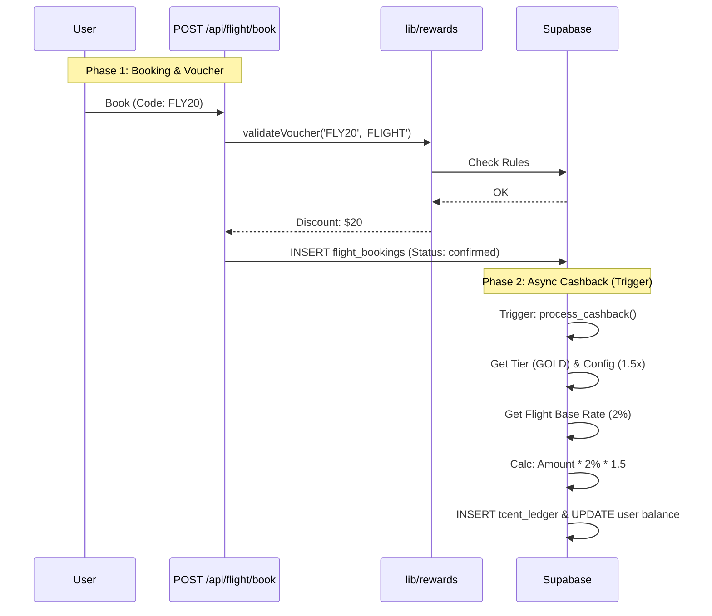

# Rewards Module Architecture Recommendation

## Context
You have a Modular Monolith structure where "Services" (Flight, Hotel, etc.) are collections of Next.js API routes (`app/api/flight/*`) and Supabase tables.

You need a **Rewards Module** to standardize:
1.  **Voucher Application** (Validation & Discount)
2.  **T-Cent Cashback** (Post-payment)

## Strategy: Shared Library & Event-Driven Database

### 1. Synchronous Validation (Pre-Payment)
Since everything runs in the same Next.js instance, use a shared library approach for maximum performance and type safety.

*   **Location**: `lib/rewards/vouchers.ts`
*   **Usage**: The Flight API imports this to validate vouchers *before* creating the booking.

**Example Flow (`POST /api/flight/book`):**
1.  User submits booking with `voucherCode`.
2.  Flight API calls `await validateVoucher({ code, userId, serviceType: 'FLIGHT', amount })`.
3.  Rewards Lib returns `{ isValid: true, discount: 50 }`.
4.  Flight API calculates final price and inserts into `flight_bookings`.

### 2. Asynchronous Cashback (Post-Payment)
To keep the Flight API decoupled from Rewards logic (T-Cents, Tiers), use **Database Triggers** or **Supabase Edge Functions**.


**The Trigger/Async Approach (Recommended):**
1.  `flight_bookings` row is updated to `status = 'confirmed'`.
2.  Postgres Trigger fires `after_booking_confirmed`.
3.  Trigger calls a generic `process_cashback` function.
4.  User's `tcent_balance` is updated.

**Calculation Formula:**
> `Reward (TCents) = (Payment Amount * Service Margin * 100) * Tier Multiplier`

*   **Payment Amount**: Real money paid (e.g. $100).
*   **Service Margin**: Defined in `service_rewards` (e.g. Hotel = 0.05 for 5% margin allocation).
*   **Conversion**: 1 USD = 100 T-Cents.
*   **Tier Multiplier**: From `tier_configs` (e.g. Gold = 1.5x).

**Example:**
*   User pays **$200** for a Hotel.
*   Hotel Margin = **5%** (0.05).
*   Base Reward Value = $200 * 0.05 = **$10**.
*   Convert to T-Cents = $10 * 100 = **1000 T-Cents**.
*   User is **Gold** (1.5x).
*   **Final Award**: 1000 * 1.5 = **1500 T-Cents**.

## Database Schema Updates

Ensure these configuration tables exist to drive the logic:

```sql
-- 1. Tier Rules (Dynamic Multipliers)
CREATE TABLE tier_configs (
    id SERIAL PRIMARY KEY,
    tier_name VARCHAR(50) UNIQUE NOT NULL, -- 'BRONZE', 'SILVER', 'GOLD', 'PLATINUM'
    earning_multiplier DECIMAL(3, 2) DEFAULT 1.00, -- 1.0, 1.2, 1.5, 2.0
    min_spend_threshold DECIMAL(10, 2) NOT NULL,
    created_at TIMESTAMP DEFAULT NOW()
);

-- 2. Service-Specific Margins
CREATE TABLE service_rewards (
    id SERIAL PRIMARY KEY,
    service_type VARCHAR(50) UNIQUE NOT NULL, -- 'FLIGHT', 'HOTEL', 'DINING'
    base_reward_percentage DECIMAL(4, 4) NOT NULL, -- 0.0500 (5%), 0.0200 (2%)
    is_active BOOLEAN DEFAULT true,
    updated_at TIMESTAMP DEFAULT NOW()
);
```

## Data Flow Diagram



## Implementation Strategy using Supabase

Since you are using Supabase, you have a massive advantage: **Database Webhooks** and **Edge Functions**.

1.  **Shared Database Schema (or dedicated schema)**:
    *   Keep `vouchers`, `user_vouchers`, `tcent_ledger`, `users` in a central `rewards` schema or the public schema if manageable.
    *   Microservices should **READ ONLY** from this schema if they need direct access, but preferably go through the API.

2.  **Edge Functions for Logic**:
    *   Deploy `validate-voucher` as a Supabase Edge Function. It's fast, globally distributed, and scales easily.
    *   Any microservice can call `https://your-project.functions.supabase.co/validate-voucher`.

3.  **Database Triggers for Safety**:
    *   Use Postgres triggers to ensure a voucher isn't double-used if two services try to redeem it simultaneously (Row Level Locking).

## Summary Checklist
- [ ] Expose `POST /api/v1/vouchers/validate` (or Edge Function).
- [ ] Expose `POST /api/v1/rewards/process-payment` (Secured Webhook).
- [ ] Ensure `tcent_ledger` is the only way balance is modified.
