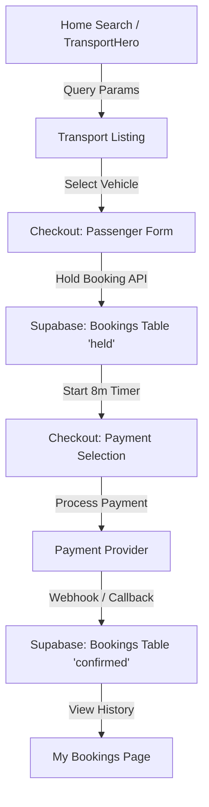

# Transport Module - Workflow & System Architecture

This document describes the architectural flow and key components of the Transport Booking Module.

## 1. File Map

### Frontend Components
- `app/transport/page.tsx`: Main transport listing and search page.
- `components/transport/TransportHero.tsx`: Search interface with real-time validation.
- `components/transport/PopularTransfers.tsx`: Personalized recommendations based on search history.
- `app/transport/checkout/page.tsx`: The multi-step checkout flow (Passenger Details -> Payment).
- `components/transport/checkout/CheckoutHeader.tsx`: Progress tracking for the checkout steps.
- `components/transport/checkout/CheckoutBookingSummary.tsx`: Summary of the selected route, vehicle, and price.
- `components/transport/checkout/PaymentSection.tsx`: Integration with payment methods (Momo, VNPay, etc.).
- `app/my-bookings/page.tsx`: User profile page to view history and pending payments.

### API Routes & Logic
- `app/api/transport/popular/route.ts`: Fetched recommended transfers.
- `app/api/transport/hold-booking/route.ts`: Handles the 8-minute reservation hold logic.
- `app/api/bookings/create/route.ts`: Finalizes the booking record in the database.
- `lib/hooks/useBookings.ts`: Custom React hook for fetching and managing user bookings.
- `store/useBookingStore.ts`: Global state for the current booking session.

### Database
- `database/transport/sql/transport_enhancements.sql`: Schema for search history.
- `database/transport/sql/unified_booking_migration.sql`: Unified bookings and payments schema.

## 2. Data Flow

1.  **Home Search**: User enters origin, destination, and date.
2.  **Transport Listing**: Displays available vehicles. Validates >1 hour constraint.
3.  **Passenger Form**: Collected names, contact info, and special requests.
4.  **Hold Booking**: On step transition, the system creates a booking record with status `held` to reserve the vehicle for 8 minutes.
5.  **Checkout (Payment)**: User selects payment method and completes transaction.
6.  **Supabase DB**: Data is persisted across `bookings`, `payments`, and `user_search_history` tables.

## 3. Component - Table Connections
- **FleetPreview / Vehicle Cards**: Read from `transport_routes` and `transport_fleets`.
- **BookingPage / MyBookings**: Read/Write to `bookings`.
- **Search History**: Writes to `user_search_history` on every search action.
- **PaymentSection**: Writes to `payments` table and updates `bookings.status`.
