# PayPal Payment Integration Guide - TRAVYY Project

> **Last Updated**: 2026-01-27  
> **Author**: Development Team  
> **Status**: Production Ready

---

## 📋 Table of Contents

1. [Overview](#overview)
2. [Environment Variables](#environment-variables)
3. [Creating PayPal Developer Account](#creating-paypal-developer-account)
4. [Backend Architecture](#backend-architecture)
5. [Frontend Implementation](#frontend-implementation)
6. [Payment Flow](#payment-flow)
7. [API Endpoints](#api-endpoints)
8. [Testing](#testing)
9. [Troubleshooting](#troubleshooting)

---

## 🎯 Overview

The TRAVYY project integrates PayPal as a payment gateway to support international transactions. The integration uses PayPal's REST API v2 with OAuth 2.0 authentication.

### Key Features
- ✅ **Cart-based payments** - Pay for multiple selected tours
- ✅ **Buy-now payments** - Direct single tour purchase
- ✅ **Retry payments** - Retry failed bookings
- ✅ **Voucher support** - Apply discount codes
- ✅ **Currency conversion** - VND to USD conversion
- ✅ **Idempotent operations** - Prevent duplicate bookings
- ✅ **Session management** - Track payment state across redirects

---

## 🔑 Environment Variables

### Required PayPal Keys

Add these to your `touring-be/.env` file:

```env
# PayPal Configuration
PAYPAL_CLIENT_ID=your_paypal_client_id_here
PAYPAL_SECRET=your_paypal_secret_here
PAYPAL_MODE=sandbox

# Currency Exchange Rate (VND to USD)
FX_VND_USD=0.000039

# Client URL (for redirects)
CLIENT_URL=http://localhost:5173
```

### Current Configuration (Example)

```env
PAYPAL_CLIENT_ID=AWIS9sTpfG1KmkiOE3u6LMithJVI7n7m5bfCqHYkEgtm5rsQ1Bg1nVjheOIEy62wnoprvPCSw5BTWBcx
PAYPAL_SECRET=EPmsviCsy6B5cYcDA6IPm3pxCMeiKS_YQQr_RgOJvymav2zMKuLqbAL5Q6mhuO-BQIOZUr3Fmf-jntu3
PAYPAL_MODE=sandbox
FX_VND_USD=0.000039
```

> [!WARNING]
> **Never commit real credentials to version control!** Use `.env` files and add them to `.gitignore`.

### Environment Variable Details

| Variable | Description | Example |
|----------|-------------|---------|
| `PAYPAL_CLIENT_ID` | Your PayPal REST API Client ID | `AWIS9sTpfG...` |
| `PAYPAL_SECRET` | Your PayPal REST API Secret Key | `EPmsviCsy...` |
| `PAYPAL_MODE` | Environment mode: `sandbox` or `live` | `sandbox` |
| `FX_VND_USD` | Exchange rate from VND to USD | `0.000039` |
| `CLIENT_URL` | Frontend URL for payment redirects | `http://localhost:5173` |

---

## 🏗️ Creating PayPal Developer Account

### Step 1: Sign Up for PayPal Developer Account

1. Go to [PayPal Developer Portal](https://developer.paypal.com/)
2. Click **"Log in to Dashboard"** (top right)
3. Sign in with your PayPal account or create a new one
4. Accept the Developer Terms of Service

### Step 2: Create a Sandbox Application

1. Navigate to **Dashboard** → **My Apps & Credentials**
2. Ensure you're on the **Sandbox** tab
3. Click **"Create App"** button
4. Fill in the application details:
   - **App Name**: `TRAVYY Tour Booking` (or your preferred name)
   - **Sandbox Business Account**: Select or create a test business account
5. Click **"Create App"**

### Step 3: Get Your API Credentials

After creating the app, you'll see:

```
Client ID: AWIS9sTpfG1KmkiOE3u6LMithJVI7n7m5bfCqHYkEgtm5rsQ1Bg1nVjheOIEy62wnoprvPCSw5BTWBcx
Secret: EPmsviCsy6B5cYcDA6IPm3pxCMeiKS_YQQr_RgOJvymav2zMKuLqbAL5Q6mhuO-BQIOZUr3Fmf-jntu3
```

> [!TIP]
> Click **"Show"** next to Secret to reveal the full secret key.

### Step 4: Configure App Settings

1. Scroll down to **"App Settings"**
2. Enable **"Accept payments"** feature
3. Under **"Return URL"**, add:
   ```
   http://localhost:5173/payment/callback
   ```
4. Under **"Cancel URL"**, add:
   ```
   http://localhost:5173/shoppingcarts
   ```
5. Click **"Save"**

### Step 5: Create Test Accounts (Optional)

For testing, create sandbox buyer accounts:

1. Go to **Sandbox** → **Accounts**
2. Click **"Create Account"**
3. Select **"Personal"** account type
4. Fill in details and click **"Create Account"**
5. Use these credentials to test payments

### Step 6: Switch to Live (Production)

When ready for production:

1. Go to **My Apps & Credentials** → **Live** tab
2. Create a new app (same process as sandbox)
3. Get Live credentials
4. Update `.env`:
   ```env
   PAYPAL_MODE=live
   PAYPAL_CLIENT_ID=<live_client_id>
   PAYPAL_SECRET=<live_secret>
   ```

> [!CAUTION]
> **Live mode processes real money!** Thoroughly test in sandbox before switching.

---

## 🔧 Backend Architecture

### File Structure

```
touring-be/
├── controller/
│   └── paypal.controller.js      # Main PayPal logic
├── routes/
│   └── paypal.routes.js           # PayPal API routes
├── models/
│   ├── PaymentSession.js          # Payment session schema
│   └── Bookings.js                # Booking schema
└── utils/
    └── paymentHelpers.js          # Shared payment utilities
```

### Controller: `paypal.controller.js`

Located at: [touring-be/controller/paypal.controller.js](file:///d:/FPT/Ky5/SWP391/TRAVYY-touring-website/touring-be/controller/paypal.controller.js)

#### Key Functions

##### 1. `getAccessToken()`
Authenticates with PayPal OAuth 2.0 API.

```javascript
async function getAccessToken() {
  const client = process.env.PAYPAL_CLIENT_ID;
  const secret = process.env.PAYPAL_SECRET;
  
  const auth = Buffer.from(`${client}:${secret}`).toString("base64");
  const res = await fetch(`${PAYPAL_BASE}/v1/oauth2/token`, {
    method: "POST",
    headers: {
      "Authorization": `Basic ${auth}`,
      "Content-Type": "application/x-www-form-urlencoded",
    },
    body: "grant_type=client_credentials",
  });
  
  const data = await res.json();
  return data.access_token;
}
```

**Environment Detection:**
```javascript
const PAYPAL_BASE = process.env.PAYPAL_MODE === "live" 
  ? "https://api-m.paypal.com" 
  : "https://api-m.sandbox.paypal.com";
```

##### 2. `createOrder(req, res)`
Creates a PayPal order and returns the order ID for frontend redirect.

**Request Body:**
```json
{
  "mode": "cart",  // or "buy-now" or "retry-payment"
  "item": {        // for buy-now mode
    "tourId": "507f1f77bcf86cd799439012",
    "date": "2026-02-15",
    "adults": 2,
    "children": 1
  },
  "promotionCode": "SUMMER2026",  // optional
  "discountAmount": 500000        // optional (VND)
}
```

**Response:**
```json
{
  "orderID": "8XY12345ABC67890"
}
```

**Key Logic:**
- Builds charge from cart or buy-now item
- Converts VND to USD using `FX_VND_USD`
- Applies voucher discounts
- Creates PayPal order via REST API
- Saves `PaymentSession` to database
- Holds tour seats temporarily (1 minute)

##### 3. `captureOrder(req, res)`
Captures payment after user approves on PayPal.

**Request Body:**
```json
{
  "orderID": "8XY12345ABC67890"
}
```

**Response:**
```json
{
  "success": true,
  "bookingId": "507f1f77bcf86cd799439012"
}
```

**Key Logic:**
- Checks for existing booking (idempotent)
- Retrieves `PaymentSession` from database
- Captures payment via PayPal API
- Creates booking from session data
- Marks voucher as used
- Confirms held seats permanently
- Clears user's cart
- Handles retry payments

##### 4. `getConfig(req, res)`
Returns PayPal configuration for frontend.

**Response:**
```json
{
  "clientId": "AWIS9sTpfG...",
  "currency": "USD"
}
```

### Routes: `paypal.routes.js`

Located at: [touring-be/routes/paypal.routes.js](file:///d:/FPT/Ky5/SWP391/TRAVYY-touring-website/touring-be/routes/paypal.routes.js)

```javascript
const express = require("express");
const authJwt = require("../middlewares/authJwt");
const { createOrder, captureOrder, getConfig } = require("../controller/paypal.controller");

const router = express.Router();

// Get PayPal config (clientId, currency) for frontend
router.get("/config", getConfig);

// Create order on PayPal (cart or buy-now)
router.post("/create-order", authJwt, createOrder);

// Capture after user approves
router.post("/capture", authJwt, captureOrder);

module.exports = router;
```

### Models

#### PaymentSession Schema

```javascript
{
  userId: ObjectId,
  provider: "paypal",
  orderId: "8XY12345ABC67890",
  amount: 5000000,  // VND
  status: "pending",  // or "paid" or "failed"
  mode: "cart",  // or "buy-now" or "retry-payment"
  items: [{
    name: "Tour Name • 2026-02-15",
    price: 2500000,
    tourId: ObjectId,
    meta: {
      date: "2026-02-15",
      adults: 2,
      children: 1,
      unitPriceAdult: 1500000,
      unitPriceChild: 750000
    }
  }],
  voucherCode: "SUMMER2026",
  discountAmount: 500000,
  rawCreateResponse: { /* PayPal API response */ },
  createdAt: Date,
  paidAt: Date
}
```

### Helper Functions

#### Currency Conversion

```javascript
function toUSD(vnd) {
  const FX = 0.000039;  // from env
  const usd = (Number(vnd) || 0) * FX;
  return (Math.round(usd * 100) / 100).toFixed(2);
}
```

**Example:**
```javascript
toUSD(5000000)  // "195.00" USD
```

#### Price Calculation with Rounding

To avoid PayPal's `DECIMAL_PRECISION` errors:

```javascript
// Convert each line item to cents (integer)
const lineCents = items.map(i => {
  const usd = Number(toUSD(i.unit_amount_vnd));
  return Math.round(usd * 100) * (i.quantity || 1);
});

// Sum all cents
const itemTotalCents = lineCents.reduce((a, b) => a + b, 0);

// Apply discount
const discountCents = Math.round(Number(toUSD(discountAmount)) * 100);
const finalAmountCents = Math.max(0, itemTotalCents - discountCents);

// Convert back to dollars
const finalAmountUSD = (finalAmountCents / 100).toFixed(2);
```

---

## 🎨 Frontend Implementation

### File Structure

```
touring-fe/src/
├── components/
│   ├── CheckOutForm.jsx           # Payment form UI
│   └── VoucherSelector.jsx        # Voucher selection
└── pages/
    └── PaymentCallback.jsx        # Payment result handler
```

### Checkout Form: `CheckOutForm.jsx`

Located at: [touring-fe/src/components/CheckOutForm.jsx](file:///d:/FPT/Ky5/SWP391/TRAVYY-touring-website/touring-fe/src/components/CheckOutForm.jsx)

#### PayPal Payment Handler

```javascript
const handlePayment = async () => {
  if (selectedPayment === "paypal") {
    try {
      setIsProcessingPayment(true);

      const payload = {
        mode,  // "cart", "buy-now", or "retry-payment"
        ...(mode === "buy-now" && { item: buyNowItem }),
        ...(mode === "retry-payment" && { 
          retryItems: retryPaymentItems,
          retryBookingId: retryBookingId 
        }),
        ...(appliedVoucher && {
          promotionCode: appliedVoucher.code,
          discountAmount: discountAmount,
          finalAmount: finalTotal,
        }),
      };

      const respJson = await withAuth('/api/paypal/create-order', {
        method: 'POST',
        headers: { 'Content-Type': 'application/json' },
        body: JSON.stringify(payload),
      });

      const { orderID } = respJson;

      if (!orderID) {
        throw new Error("Không nhận được orderID từ server");
      }

      // Redirect to PayPal
      const paypalUrl = `https://www.sandbox.paypal.com/checkoutnow?token=${orderID}`;
      window.location.href = paypalUrl;

    } catch (error) {
      console.error("❌ PayPal payment error:", error);
      alert(`Lỗi thanh toán: ${error.message}`);
      setIsProcessingPayment(false);
    }
  }
};
```

#### UI Components

**PayPal Payment Option:**

```jsx
<div
  onClick={() => setSelectedPayment("paypal")}
  className={`p-4 border-2 rounded-xl cursor-pointer transition-all ${
    selectedPayment === "paypal" ? "border-blue-500 bg-blue-50" : "border-gray-200"
  }`}
>
  <div className="flex items-center justify-between">
    <div className="flex items-center gap-3">
      <div className={`w-5 h-5 rounded-full border-2 ${
        selectedPayment === "paypal" ? "border-blue-500" : "border-gray-300"
      }`}>
        {selectedPayment === "paypal" && <div className="w-3 h-3 rounded-full bg-blue-500" />}
      </div>
      <CreditCard className="w-6 h-6 text-gray-700" />
      <span className="font-medium text-gray-900">PayPal</span>
    </div>
    
  </div>
</div>
```

### Payment Callback: `PaymentCallback.jsx`

Located at: [touring-fe/src/pages/PaymentCallback.jsx](file:///d:/FPT/Ky5/SWP391/TRAVYY-touring-website/touring-fe/src/pages/PaymentCallback.jsx)

#### PayPal Callback Handler

```javascript
useEffect(() => {
  const run = async () => {
    const paypalOrderId = searchParams.get('token');

    if (paypalOrderId) {
      try {
        setStatus('processing');
        setProvider('paypal');
        setOrderRef(paypalOrderId);

        const resp = await fetch(`${API_BASE}/api/paypal/capture`, {
          method: 'POST',
          headers: {
            'Content-Type': 'application/json',
            'Authorization': `Bearer ${user?.token}`,
          },
          credentials: 'include',
          body: JSON.stringify({ orderID: paypalOrderId })
        });

        if (!resp.ok) {
          const err = await resp.json().catch(() => ({}));
          throw new Error(err.error || 'Thanh toán thất bại');
        }

        const data = await resp.json();
        if (data.success && data.bookingId) {
          setStatus('success');
          setMessage('Thanh toán PayPal thành công!');
          setBookingId(data.bookingId);
          await refreshCart();  // Clear cart
        }
      } catch(e) {
        console.error('PayPal callback error', e);
        setStatus('error');
        setMessage(e.message || 'Lỗi thanh toán PayPal');
      }
    }
  };
  run();
}, [searchParams, user]);
```

#### Success UI

```jsx
{status === "success" && (
  <>
    <CheckCircle2 className="w-16 h-16 text-green-500 mx-auto mb-4" />
    <h2 className="text-2xl font-bold text-gray-900 mb-2">Thanh toán thành công!</h2>
    <p className="text-gray-600 mb-4">{message}</p>
    {bookingId && (
      <p className="text-sm text-gray-500 mb-6">Mã đặt chỗ: {bookingId}</p>
    )}
    <button
      onClick={() => navigate("/profile/booking-history")}
      className="w-full bg-purple-600 text-white py-3 rounded-lg"
    >
      Xem vé của tôi
    </button>
  </>
)}
```

---

## 🔄 Payment Flow

### Complete Payment Flow Diagram

```mermaid
sequenceDiagram
    participant User
    participant Frontend
    participant Backend
    participant PayPal
    participant Database

    User->>Frontend: Click "Tiếp tục thanh toán"
    Frontend->>Frontend: Validate form & payment method
    Frontend->>Backend: POST /api/paypal/create-order
    
    Backend->>Database: Fetch cart items / buy-now item
    Backend->>Backend: Calculate total (VND → USD)
    Backend->>Backend: Apply voucher discount
    Backend->>PayPal: POST /v2/checkout/orders (OAuth)
    PayPal-->>Backend: Return orderID
    Backend->>Database: Save PaymentSession
    Backend->>Database: Hold tour seats (1 min)
    Backend-->>Frontend: Return { orderID }
    
    Frontend->>PayPal: Redirect to PayPal checkout
    User->>PayPal: Login & approve payment
    PayPal->>Frontend: Redirect to /payment/callback?token=orderID
    
    Frontend->>Backend: POST /api/paypal/capture
    Backend->>Database: Check existing booking (idempotent)
    Backend->>Database: Fetch PaymentSession
    Backend->>PayPal: POST /v2/checkout/orders/{id}/capture
    PayPal-->>Backend: Return capture details
    
    Backend->>Database: Update PaymentSession (status=paid)
    Backend->>Database: Create Booking
    Backend->>Database: Mark voucher as used
    Backend->>Database: Confirm held seats
    Backend->>Database: Clear user cart
    Backend-->>Frontend: Return { success: true, bookingId }
    
    Frontend->>Frontend: Refresh cart
    Frontend->>User: Show success message
```



### Step-by-Step Flow

#### 1. **User Initiates Payment**
- User fills in booking information
- Selects PayPal as payment method
- Clicks "Tiếp tục thanh toán" button

#### 2. **Frontend Validation**
```javascript
if (!isFormValid) {
  alert("Vui lòng điền đầy đủ thông tin");
  return;
}
if (!selectedPayment) {
  alert("Vui lòng chọn phương thức thanh toán");
  return;
}
```

#### 3. **Create PayPal Order**
- Frontend sends request to `/api/paypal/create-order`
- Backend builds charge from cart/buy-now item
- Backend converts VND to USD
- Backend creates PayPal order
- Backend saves `PaymentSession` to database
- Backend holds tour seats temporarily

#### 4. **Redirect to PayPal**
```javascript
const paypalUrl = `https://www.sandbox.paypal.com/checkoutnow?token=${orderID}`;
window.location.href = paypalUrl;
```

#### 5. **User Approves on PayPal**
- User logs into PayPal account
- Reviews order details
- Approves payment
- PayPal redirects back to: `/payment/callback?token={orderID}`

#### 6. **Capture Payment**
- Frontend detects `token` parameter
- Sends capture request to `/api/paypal/capture`
- Backend captures payment from PayPal
- Backend creates booking
- Backend marks voucher as used
- Backend confirms seats
- Backend clears cart

#### 7. **Show Success**
- Frontend displays success message
- Shows booking ID
- Provides navigation to booking history

---

## 📡 API Endpoints

### 1. Get PayPal Config

**Endpoint:** `GET /api/paypal/config`

**Authentication:** Not required

**Response:**
```json
{
  "clientId": "AWIS9sTpfG1KmkiOE3u6LMithJVI7n7m5bfCqHYkEgtm5rsQ1Bg1nVjheOIEy62wnoprvPCSw5BTWBcx",
  "currency": "USD"
}
```

**Usage:**
```javascript
const config = await fetch('/api/paypal/config').then(r => r.json());
console.log(config.clientId);  // For frontend PayPal SDK (if needed)
```

---

### 2. Create PayPal Order

**Endpoint:** `POST /api/paypal/create-order`

**Authentication:** Required (JWT)

**Request Body (Cart Mode):**
```json
{
  "mode": "cart",
  "promotionCode": "SUMMER2026",
  "discountAmount": 500000
}
```

**Request Body (Buy-Now Mode):**
```json
{
  "mode": "buy-now",
  "item": {
    "tourId": "507f1f77bcf86cd799439012",
    "date": "2026-02-15",
    "adults": 2,
    "children": 1
  },
  "promotionCode": "WELCOME10",
  "discountAmount": 200000
}
```

**Request Body (Retry Payment Mode):**
```json
{
  "mode": "retry-payment",
  "retryItems": [
    {
      "tourId": "507f1f77bcf86cd799439012",
      "date": "2026-02-15",
      "adults": 2,
      "children": 1,
      "name": "Tour Name",
      "unitPriceAdult": 1500000,
      "unitPriceChild": 750000
    }
  ],
  "retryBookingId": "507f1f77bcf86cd799439013"
}
```

**Success Response:**
```json
{
  "orderID": "8XY12345ABC67890"
}
```

**Error Response:**
```json
{
  "error": "PAYPAL_CREATE_FAILED",
  "debug": {
    "stage": "createOrder",
    "status": 400,
    "data": { /* PayPal error details */ }
  }
}
```

---

### 3. Capture PayPal Order

**Endpoint:** `POST /api/paypal/capture`

**Authentication:** Required (JWT)

**Request Body:**
```json
{
  "orderID": "8XY12345ABC67890"
}
```

**Success Response:**
```json
{
  "success": true,
  "bookingId": "507f1f77bcf86cd799439012"
}
```

**Error Response:**
```json
{
  "error": "PAYPAL_CAPTURE_FAILED"
}
```

**Idempotency:**
If booking already exists for this orderID, returns existing booking:
```json
{
  "success": true,
  "bookingId": "507f1f77bcf86cd799439012"
}
```

---

## 🧪 Testing

### Test Environment Setup

1. **Use Sandbox Credentials**
   ```env
   PAYPAL_MODE=sandbox
   PAYPAL_CLIENT_ID=<sandbox_client_id>
   PAYPAL_SECRET=<sandbox_secret>
   ```

2. **Create Test Buyer Account**
   - Go to [PayPal Sandbox](https://developer.paypal.com/dashboard/accounts)
   - Create a Personal (buyer) account
   - Note the email and password

### Test Scenarios

#### ✅ Scenario 1: Successful Cart Payment

1. Add tours to cart
2. Select items for checkout
3. Apply voucher (optional)
4. Select PayPal payment method
5. Fill in user information
6. Click "Tiếp tục thanh toán"
7. Login with sandbox buyer account
8. Approve payment
9. Verify redirect to success page
10. Check booking in database

**Expected Result:**
- Payment captured successfully
- Booking created with status `paid`
- Cart cleared
- Voucher marked as used
- Seats confirmed

#### ✅ Scenario 2: Buy-Now Payment

1. Navigate to tour detail page
2. Select date and passengers
3. Click "Đặt ngay"
4. Select PayPal
5. Complete payment flow

**Expected Result:**
- Single booking created
- No cart interaction

#### ✅ Scenario 3: Retry Failed Payment

1. Create a failed booking
2. Navigate to booking history
3. Click "Thử lại thanh toán"
4. Complete PayPal flow

**Expected Result:**
- Existing booking updated to `paid`
- No duplicate booking created

#### ❌ Scenario 4: Payment Cancellation

1. Start payment flow
2. On PayPal page, click "Cancel and return"
3. Verify redirect to cart page

**Expected Result:**
- No booking created
- Cart items still selected
- Seats released after 1 minute

#### ❌ Scenario 5: Insufficient Funds

1. Use sandbox buyer with $0 balance
2. Attempt payment

**Expected Result:**
- PayPal shows error
- No booking created
- User can retry

### Testing with cURL

#### Create Order
```bash
curl -X POST http://localhost:4000/api/paypal/create-order \
  -H "Content-Type: application/json" \
  -H "Authorization: Bearer YOUR_JWT_TOKEN" \
  -d '{
    "mode": "buy-now",
    "item": {
      "tourId": "507f1f77bcf86cd799439012",
      "date": "2026-02-15",
      "adults": 2,
      "children": 1
    }
  }'
```

#### Capture Order
```bash
curl -X POST http://localhost:4000/api/paypal/capture \
  -H "Content-Type: application/json" \
  -H "Authorization: Bearer YOUR_JWT_TOKEN" \
  -d '{
    "orderID": "8XY12345ABC67890"
  }'
```

### Monitoring Logs

Enable detailed logging in development:

```javascript
console.log("🔍 createOrder request:", req.body);
console.log("💰 Price calculation:", { totalVND, discountAmount, finalTotalVND });
console.log("✅ Order created:", orderID);
console.log("🎫 Confirming held seats...");
console.log("✅ Booking created:", booking._id);
```

---

## 🔧 Troubleshooting

### Common Errors

#### 1. `MISSING_PAYPAL_CREDENTIALS`

**Error:**
```json
{
  "error": "CREATE_ORDER_FAILED",
  "debug": {
    "message": "MISSING_PAYPAL_CREDENTIALS",
    "code": "MISSING_PAYPAL_CREDENTIALS"
  }
}
```

**Solution:**
- Check `.env` file has `PAYPAL_CLIENT_ID` and `PAYPAL_SECRET`
- Restart backend server after updating `.env`
- Verify credentials are not empty strings

**Verification:**
```bash
# Windows PowerShell
cat touring-be/.env | Select-String PAYPAL

# Expected output:
# PAYPAL_CLIENT_ID=AWIS9s...
# PAYPAL_SECRET=EPmsvi...
# PAYPAL_MODE=sandbox
```

---

#### 2. `PAYPAL_OAUTH_FAILED`

**Error:**
```json
{
  "error": "CREATE_ORDER_FAILED",
  "debug": {
    "message": "PAYPAL_OAUTH_FAILED",
    "status": 401
  }
}
```

**Solution:**
- Verify credentials are correct (copy-paste from PayPal dashboard)
- Check `PAYPAL_MODE` matches credential environment (sandbox vs live)
- Ensure no extra spaces in `.env` values

---

#### 3. `DECIMAL_PRECISION` Error

**Error from PayPal:**
```json
{
  "name": "UNPROCESSABLE_ENTITY",
  "details": [{
    "issue": "DECIMAL_PRECISION",
    "description": "If the currency does not support decimals, only integer amounts are supported."
  }]
}
```

**Solution:**
This is already handled in the code with cent-based rounding:
```javascript
const lineCents = items.map(i => {
  const usd = Number(toUSD(i.unit_amount_vnd));
  return Math.round(usd * 100) * (i.quantity || 1);
});
```

If still occurring, check:
- `FX_VND_USD` is set correctly
- Item prices are valid numbers
- No NaN values in calculations

---

#### 4. `PAYMENT_SESSION_NOT_FOUND`

**Error:**
```json
{
  "error": "PAYMENT_SESSION_NOT_FOUND"
}
```

**Cause:**
- Session was not saved during order creation
- OrderID mismatch
- Session expired (>10 minutes old)

**Solution:**
- Check database for `PaymentSession` collection
- Verify `orderId` field matches PayPal's `orderID`
- Check server logs for session creation errors

**Debug Query:**
```javascript
// In MongoDB shell
db.paymentsessions.find({ orderId: "8XY12345ABC67890" })
```

---

#### 5. Redirect Loop

**Symptom:**
User keeps getting redirected between PayPal and callback page.

**Solution:**
- Check `hasProcessed` ref in `PaymentCallback.jsx`:
  ```javascript
  const hasProcessed = useRef(false);
  
  useEffect(() => {
    if (hasProcessed.current) return;
    hasProcessed.current = true;
    // ... rest of code
  }, []);
  ```

---

#### 6. Cart Not Clearing After Payment

**Symptom:**
Paid items still appear in cart.

**Solution:**
- Verify `clearCartAfterPayment()` is called in `captureOrder`
- Check `refreshCart()` is called in frontend callback
- Ensure user is authenticated during cart clear

**Backend Check:**
```javascript
try {
  await clearCartAfterPayment(userId);
  console.log(`✅ Cleared cart for user ${userId}`);
} catch (clearErr) {
  console.error(`⚠️ Failed to clear cart:`, clearErr);
}
```

---

#### 7. Voucher Not Applied

**Symptom:**
Discount not reflected in PayPal payment amount.

**Solution:**
- Verify `discountAmount` is sent in create-order request
- Check discount calculation in backend:
  ```javascript
  const discountAmount = Number(req.body.discountAmount) || 0;
  const finalTotalVND = Math.max(0, totalVND - discountAmount);
  ```
- Ensure breakdown includes discount:
  ```javascript
  if (discountCents > 0) {
    breakdown.discount = {
      currency_code: currency,
      value: discountUSD,
    };
  }
  ```

---

### Debug Checklist

When payment fails, check:

- [ ] `.env` file has all required variables
- [ ] Backend server restarted after `.env` changes
- [ ] PayPal credentials are from correct environment (sandbox/live)
- [ ] `PAYPAL_MODE` matches credentials
- [ ] User is authenticated (JWT token valid)
- [ ] Cart has items (for cart mode)
- [ ] Tour and date are valid (for buy-now mode)
- [ ] MongoDB is running and accessible
- [ ] Network can reach PayPal API
- [ ] Browser console shows no CORS errors
- [ ] Backend logs show detailed error messages

---

## 📚 Additional Resources

### Official Documentation
- [PayPal REST API Reference](https://developer.paypal.com/api/rest/)
- [PayPal Orders API v2](https://developer.paypal.com/docs/api/orders/v2/)
- [PayPal OAuth 2.0](https://developer.paypal.com/api/rest/authentication/)

### Related Files
- [momo-payment-integration.md](file:///d:/FPT/Ky5/SWP391/TRAVYY-touring-website/momo-payment-integration.md) - MoMo integration guide
- [README.md](file:///d:/FPT/Ky5/SWP391/TRAVYY-touring-website/README.md) - Project setup
- [DEBUGGING_GUIDE.md](file:///d:/FPT/Ky5/SWP391/TRAVYY-touring-website/DEBUGGING_GUIDE.md) - General debugging

### Support
- PayPal Developer Community: https://www.paypal-community.com/
- PayPal Support: https://developer.paypal.com/support/

---

## 📝 Changelog

### 2026-01-27
- ✅ Initial documentation created
- ✅ Added environment variable guide
- ✅ Documented account creation process
- ✅ Explained backend architecture
- ✅ Detailed frontend implementation
- ✅ Created payment flow diagram
- ✅ Listed all API endpoints
- ✅ Added testing scenarios
- ✅ Compiled troubleshooting guide

---

**End of Document**
